# Introduction to Cryptography 

## Definition

Cryptography is the technique to protect information/data by turning it into unreadable form so that only the right people can read it. 
It ensures that data can only be accessed or interpreted by authorized entities.

Derived from Greek words: "kryptos" (hidden) + "graphein" (writing).

## Importance of Cryptography

With the rapid growth of digital communication, a lot of personal and important information is sent over the Internet every day.
This information can be seen or changed by bad people if it is not protected. 

Without cryptography, data can be exposed to problems such as:
- Unauthorized access.
- Data manipulation.
- Identity theft.
- Fraud and impersonation attacks.

Cryptography is therefore a fundamental component of cybersecurity and information security.

## Objectives of Cryptography

The primary objectives of cryptography are defined by the following security principles:

#### 1. Confidentiality
Ensures that information is accessible only to authorized individuals.

#### 2. Integrity
Guarantees that data has not been altered during transmission or storage.

#### 3. Availability
Ensuring information and resources are accessible when needed

## Working in Cryptography

Cryptography is rarely a standalone job. Most of the time, it is a **core skill used inside other roles** such as cybersecurity, software engineering, and blockchain.

### Common roles involving cryptography

- **Cryptography Engineer / Applied Cryptographer**  
  Works on implementing cryptographic algorithms (AES, RSA, ECC), key management, digital signatures, and secure protocols.

- **Cybersecurity / Security Engineer**  
  Uses cryptography to secure data, APIs, communications (TLS, VPNs), and passwords.

- **Penetration Tester / Red Team**  
  Analyzes and breaks weak cryptographic implementations and misconfigurations.

- **Blockchain / Web3 Developer**  
  Uses hashing, digital signatures, and cryptography for wallets, smart contracts, and consensus systems.

- **Cryptography Researcher**  
  Focuses on theoretical cryptography and new algorithms (usually requires a Master or PhD).


## History of Cryptography

Long before computers and the Internet, humans needed to protect their secrets.
In ancient times, important information was often transmitted over long distances and could be intercepted by enemies.

This created the need for methods to ensure that only the intended recipient could understand the message.
The protection of information has therefore been a concern throughout human history, especially in military and political contexts.

---

### The Caesar Cipher 
The Caesar Cipher is one of the earliest and most well-known encryption methods, used by Julius Caesar to protect military messages.
It works by shifting each letter of the plaintext by a fixed number of positions in the alphabet.


``` 
Exemple: 
ciphertext : Khoor Shrsoh
key : 3 
plaintext : Hello People
``` 
Although simple, this cipher introduced the fundamental concept of encryption using a key.

**Limitations:**
- Only 25 possible keys
- Easy to break using brute force
- Vulnerable to frequency analysis

These weaknesses motivated the creation of stronger cryptographic methods.

---
### The Birth of Cryptanalysis

However, every new cipher attracted new methods of attack.

In the 9th century, the scientist **Al-Kindi** discovered that letters in a language appear with different frequencies.  
By analyzing these frequencies, encrypted messages could be broken without knowing the secret key.

This discovery created a new field: **cryptanalysis**, the science of breaking ciphers.

From this moment, cryptography and cryptanalysis began a continuous race:
- Cryptographers designed stronger ciphers.
- Cryptanalysts developed smarter attacks.


---

After the Caesar Cipher, cryptographers searched for stronger ways to protect messages.  
Each new cipher tried to fix the weaknesses of the previous one.


### The Rail Fence Cipher

The Rail Fence Cipher is a transposition cipher that rearranges the order of characters instead of changing them.

The message is written in a zigzag pattern and then read row by row.

This method showed that security could be achieved not only by changing letters, but also by changing their positions.


**Limitations:**
- Does not hide letter frequencies
- Easy to break with pattern analysis
- Provides low security
---

### The Vigenère Cipher 


In the 16th century, a new cipher called the **Vigenère Cipher** was introduced.

Instead of using a single shift like Caesar, the Vigenère Cipher used a **keyword** to change the shift for each letter of the message.  
This created multiple substitution alphabets, making the encrypted message much harder to analyze.

For a long time, the Vigenère Cipher was considered unbreakable and was known as *"le chiffre indéchiffrable"*.

This marked an important step in the evolution of cryptography:  
encryption was no longer simple, it became systematic and more secure.

```
Exemple:
plaintext = ILIKEGOOGLE
key = ZFLT
ciphertext = HQTDDLZHFQP
```


**Limitations:**
- Vulnerable to frequency analysis when the key length is discovered
- Broken by the Kasiski examination

---

### The Playfair Cipher

The Playfair Cipher was invented in the 19th century and was used for military communications.

Instead of encrypting single letters, it encrypted pairs of letters (digraphs) using a 5x5 matrix built from a keyword.  
This made frequency analysis more difficult and increased security compared to simple substitution ciphers.

**How it works:**
- Build a 5×5 grid with the key and the alphabet, I and J in the same cell.
- Prepare the text in letter pairs, insert X between two identical letters, add X if odd.
- Encrypt each pair: if same row shift right, if same column shift down, otherwise take the opposite corners of the rectangle.
- Concatenate the results to form the ciphertext.
- Decrypt using the same principle by reversing right/left and up/down.


**Limitations:**
- Still vulnerable to advanced cryptanalysis
- Complex but breakable with enough ciphertext
- Not secure by modern standards

---


### The Enigma Machine – From Human Ciphers to Machine Encryption

During World War II, cryptography entered the age of machines.

The German army used the Enigma machine to encrypt military communications.  
With rotating rotors and daily key changes, Enigma created millions of possible configurations.

For years, Enigma was believed to be impossible to break.

However, mathematicians and engineers, including Alan Turing, built early computing machines to analyze Enigma messages.  
This success changed both the war and the history of cryptography.


**Limitations:**
- Human configuration errors
- Predictable message formats
- Mechanical weaknesses exploited by cryptanalysts

---


### The Transition to Modern Cryptography

After the war and the rise of computers, cryptography moved from manual techniques to mathematical algorithms.

New concepts appeared:
- Symmetric encryption for protecting data
- Asymmetric encryption for secure key exchange
- Hash functions for data integrity

These ideas form the foundation of the cryptography used today in digital systems and the Internet.

This historical journey shows how cryptography evolved from simple letter shifts to powerful mathematical systems that protect modern communication.


## Modern Classification of Cryptography

After centuries of evolution, cryptography can now be classified into three main categories.


### Classical Cryptography vs Modern Cryptography

| Classical Cryptography | Modern Cryptography |
|------------------------|---------------------|
| Based on letters and symbols | Based on complex mathematical problems |
| Performed manually by humans | Performed by computers |
| Simple substitution and transposition | Algorithm-based encryption |
| Short key lengths | Much longer key lengths |
| Vulnerable to frequency analysis | Resistant to statistical attacks |
| Used in wars and diplomacy | Used in digital systems and the Internet |
| Examples: Caesar, Vigenère, Playfair, Enigma | Examples: AES, RSA, ECC, SHA |

---


## Symmetric Cryptography

In modern cryptography, computers need a fast and secure way to protect large amounts of data.
Symmetric cryptography solves this problem by using one single secret key for both encryption and decryption.

This makes symmetric encryption very efficient and widely used in real-world systems.


#### Key Characteristics:
- Uses the same secret key for encryption and decryption
- Very fast and efficient
- Suitable for large amounts of data
- Requires secure key sharing
- Security depends on keeping the key secret


## Stream Cipher: 


#### Key Point:
- Encrypts data one letter/bit at a time
- Very fast. works for live data like video, audio, or chat
- Requires a unique secret for each message
- Same key is used to encrypt and decrypt

#### Examples: 
+ Messaging apps like Signal or WhatsApp use stream ciphers to encrypt your messages instantly while you type.
+ Video calls, live streams, or real-time online games also use stream ciphers to protect data as it travels.

---

### RC4 (Rivest Cipher 4)

RC4 is a **stream cipher** designed by Ron Rivest in 1987.  
For many years, it was popular because it is **simple, fast, and easy to implement**.

RC4 generates a pseudorandom keystream and encrypts data by XOR-ing this keystream with the plaintext.

#### Where RC4 was used
- **WEP** (Wired Equivalent Privacy) for early Wi-Fi encryption
- Early versions of **SSL/TLS**
- **Microsoft Office** and **PDF** encryption


#### How RC4 works (intuitive explanation)
RC4 works in two main phases:

##### 1. Key Scheduling Algorithm (KSA)
- RC4 starts with an array `S` containing the numbers from 0 to 255
- The secret key is used to **shuffle** this array
- After this step, `S` depends entirely on the key

##### 2. Pseudo-Random Generation Algorithm (PRGA)
- RC4 continuously swaps values inside the array `S`
- Each step produces **one byte** of keystream
- This byte is XOR-ed with one byte of plaintext

```Ciphertext = Plaintext ⊕ Keystream```

The same operation is used for decryption.

#### Note:
- RC4 uses modulo 256 arithmetic (numbers wrap around after 255)
- XOR has a key property:

``` A ⊕ B ⊕ B = A ```

This is why encryption and decryption are identical operations.

#### Why RC4 is broken:
Despite its simplicity, RC4 has serious mathematical weaknesses:
- The keystream is not truly random
- Early bytes of the keystream are biased
- Some byte values appear more often than others

Attackers can exploit these biases to recover information about the plaintext or even the key.

```mermaid
flowchart TD
    A[🔑 Clé Secrète<br/>ex: 'MONKEY'] --> B
    
    subgraph B["🔀 Phase 1: Initialisation"]
        B1["Initialise S = [0,1,2,...,255]"] --> B2
        B2["j = 0<br/>Pour i de 0 à 255:"] --> B3
        B3["j = (j + S[i] + key[i mod len])"] --> B4
        B4["Échange S[i] ↔ S[j]"] --> B2
    end
    
    B --> C["📊 S initialisé<br/>ex: [125, 42, 198, ...]"]
    
    C --> D
    
    subgraph D["🎰 Phase 2: Génération"]
        D1["i = 0, j = 0"] --> D2
        D2["i = (i + 1) mod 256"] --> D3
        D3["j = (j + S[i]) mod 256"] --> D4
        D4["Échange S[i] ↔ S[j]"] --> D5
        D5["t = (S[i] + S[j]) mod 256"] --> D6
        D6["Byte-clé = S[t]"] --> D7
        D7["Ajoute à keystream"] --> D2
    end
    
    D --> E["🎯 Keystream prêt<br/>ex: 0x4A, 0xF3, 0x1B, ..."]
    
    E --> F
    
    subgraph F["🔒 Phase 3: Chiffrement"]
        F1["Message: 'HELLO'"] --> F2
        F2["Keystream"] --> F3
        F3["XOR chaque byte"] --> F4
        F4["Résultat chiffré"]
    end
    
    style A fill:#9C27B0,color:white,stroke-width:3px
    style B fill:#2196F3,color:white
    style C fill:#4CAF50,color:white
    style D fill:#FF9800,color:black
    style E fill:#009688,color:white
    style F fill:#795548,color:white
```



---

### ChaCha20

ChaCha20 is a modern, secure stream cipher designed by Daniel J. Bernstein. It was created to replace older and broken stream ciphers like RC4.

Today, ChaCha20 is widely used in:
- TLS (HTTPS)
- VPNs
- Mobile devices
- Signal, WhatsApp, and many modern applications

#### ChaCha20's Goals 
ChaCha20 was designed with the following goals:
- Strong security
- High performance
- Resistance to cryptanalysis
- Safe software implementation

Unlike RC4, ChaCha20 has no known practical attacks when used correctly.

#### ChaCha20 generates a secure keystream using:
- A 256-bit secret key
- A nonce (number used once)
- A counter

The keystream is XOR-ed with the plaintext:

```Ciphertext = Plaintext ⊕ Keystream ```

#### ChaCha20 internal structure
ChaCha20 works on a 4×4 matrix of 32-bit words (16 words total).

This matrix contains:
- Constants (fixed values)
- The secret key
- The counter
- The nonce

The algorithm applies 20 rounds of transformations to this matrix.

#### The Quarter Round 
The heart of ChaCha20 is the Quarter Round function. It mixes four numbers using:
- Addition modulo 2³²
- XOR
- Bit rotations

```Example : 
a = a + b
d = d ⊕ a
d = ROTL(d, 16)
```
These operations are fast on CPUs and create strong diffusion.

#### Why the math is strong
ChaCha20 relies on:
- Simple operations (ADD, XOR, ROTATE)
- Strong mixing of bits
- No lookup tables
- No known statistical bias

This makes ChaCha20:
- Hard to analyze
- Hard to attack
- Safe against timing attacks

#### Rule: 
Never reuse the same key + nonce pair. Always use a secure random nonce

If these rules are respected, ChaCha20 is considered cryptographically secure.

```mermaid 
flowchart TD
    A[⚙️ Algorithme ChaCha20] --> B[1. Paramètres d'entrée]
    
    B --> B1[🔑 Clé secrète 256 bits]
    B --> B2[🎫 Nonce 96 bits]
    B --> B3[🔢 Compteur 32 bits]
    
    B1 & B2 & B3 --> C[2. Transformation initiale]
    
    C --> C1[🏗️ Construction matrice 4x4<br/>Constantes + Clé + Compteur + Nonce]
    C1 --> D[3. Processus cryptographique]
    
    subgraph D[20 itérations de mélange]
        D1[Tours 1-10: Opérations sur colonnes]
        D2[Tours 11-20: Opérations sur diagonales]
    end
    
    D1 & D2 --> E[4. Génération du keystream]
    
    E --> F[📤 64 octets de sortie]
    F --> G[5. Chiffrement XOR]
    
    G --> H[🔒 Texte chiffré]
    
    style A fill:#2E86AB,color:white
    style B1 fill:#9C27B0,color:white
    style B2 fill:#FF9800,color:black
    style B3 fill:#4CAF50,color:white
    style C1 fill:#795548,color:white
    style D1 fill:#2196F3,color:white
    style D2 fill:#FF5722,color:white
    style F fill:#4CAF50,color:white
    style H fill:#009688,color:white
```



---
#### Advantages of Stream Cipher:
- High speed
- Low computational cost
- Strong security when properly implemented

#### Limitations:
- Key distribution problem (how to share the secret key securely)
- If the key is stolen, all messages are compromised
- Not suitable alone for communication over open networks

#### Real-World Uses
- File encryption
- Disk encryption
- Secure messaging
- HTTPS (after key exchange)
- VPNs


## Block Cipher:

Block ciphers work differently than Stream Cipher.

Instead of encrypting data one byte at a time, **block ciphers encrypt data in fixed-size blocks**.

#### What is a Block Cipher?
A block cipher is an encryption algorithm that:
- takes the message in fixed-size blocks
- encrypts each block separately
- uses the same secret key for encryption and decryption

#### Problem : 
How do we encrypt a long message, not just one block?

This is where modes of operation come in.

#### Why do we need modes?
A block cipher by itself can only encrypt one block.
Modes explain:
- how to link the blocks
- how to add randomness
- how to prevent attacks

--- 

### ECB – Electronic Codebook

#### How it works
- Each block is encrypted independently
- Same block → same ciphertext


#### Major problem
If two blocks are identical:
+ their encryption is also identical.

---

### CBC – Cipher Block Chaining

#### How it works
Each block depends on the previous block.

Before encryption:

``` Current block ⊕ Previous ciphertext block ```

#### IV (Initialization Vector)
- The first block uses a random IV
- Prevents identical messages from producing the same ciphertext

#### Workflow 
``` IV → Block 1 → Block 2 → Block 3 ```


#### Advantages
- Hides repetitions
- Much safer than ECB

#### Disadvantages
- No authentication (attacker could modify message undetected)
- Errors propagate


---

### DES (Data Encryption Standard)

The **DES** was one of the first widely used symmetric block ciphers.  
It was adopted as a federal standard in the 1970s to protect digital information.

DES is mainly a **block cipher**, which means it encrypts **data in fixed-size blocks** using a **single secret key**.

#### Key Features
| Feature | Description |
|---------|-------------|
| Block size | 64 bits (8 bytes) |
| Key size | 56 bits (effectively; 8 parity bits) |
| Mode of operation | ECB, CBC (most common) |
| Rounds | 16 rounds of encryption transformations |

#### How DES Works 
1. The plaintext is divided into **64-bit blocks**.  
2. Each block goes through **16 rounds** of encryption, including:
   - **Substitution**: replacing bits with other bits using fixed tables  
   - **Permutation**: shuffling bits according to a pattern  
   - **XOR with key**: combining block with part of the secret key
3. Each block becomes a **ciphertext block** of 64 bits.  
4. All blocks together form the encrypted message.


#### Modes of Operation
DES is often used with **ECB** or **CBC** modes.  
- **ECB**: encrypts each block independently → patterns can appear  
- **CBC**: encrypts each block based on the previous one → more secure

```mermaid 
flowchart TD
    A["📝 Message de départ<br/>64 bits exactement"] --> B["1. Réorganiser les bits<br/>selon la table IP"]
    
    B --> C["2. Séparer en 2 parties égales<br/>Gauche = 32 bits, Droite = 32 bits"]
    
    C --> D{3. Répéter 16 fois}
    
    
    subgraph E["Partie 4 - Un tour de DES (détaillé)"]
    F["📥 Entrée Droite R(i-1)<br/>32 bits"] --> G[" Transformation F"]
        
        subgraph G["Transformation F en 4 étapes précises"]
            G1["Étape 1: Expansion<br/>Prendre les 32 bits<br/>Les réorganiser en 48 bits<br/>en dupliquant certains bits"]
            
            G2["Étape 2: XOR avec clé<br/>Prendre les 48 bits de l'étape 1<br/>Faire XOR avec clé K(i) de 48 bits<br/>Bit à bit selon règles XOR"]
            
            G3["Étape 3: Tables S1-S8<br/>Diviser 48 bits en 8 groupes de 6 bits<br/>Chaque groupe → table S différente<br/>Chaque table donne 4 bits → total 32 bits"]
            
            G4["Étape 4: Réorganisation<br/>Prendre les 32 bits sortis des tables S<br/>Les réarranger selon table P fixe"]
        end
        
        G --> H["⊕ XOR avec la partie Gauche"]
        F --> I["Nouvelle Gauche = ancienne Droite"]
        H --> J["Nouvelle Droite = résultat du XOR"]
    end
    
    D --> E
    E --> K{Tour suivant?}
    K -->|Tour 2 à 16| D
    K -->|Fin des 16 tours| L["5. Assembler inversé<br/>Mettre Droite puis Gauche"]
    
    L --> M["6. Réorganiser selon table IP⁻¹<br/>(l'inverse de l'étape 1)"]
    M --> N["🔒 Message transformé<br/>64 bits illisibles"]
    
    O["🔑 Clé de départ 64 bits"] --> P["7. Préparer 16 clés différentes<br/>K1, K2, ..., K16"] --> G2
    
    style A fill:#4CAF50,color:white
    style B fill:#2196F3,color:white
    style E fill:#FF9800,color:black
    style G2 fill:#9C27B0,color:white
    style H fill:#FF5722,color:white
    style N fill:#009688,color:white
    style O fill:#795548,color:white
```




#### how S table works 

**Strengths:**
- Simple and easy to understand for beginners
- Good for learning how block ciphers work
- Historically important

**Weaknesses:**
- Very short key (56 bits) → can be cracked by brute force
- Old algorithm → not safe for modern systems
- Mostly **used today for learning**, not real security

---
### AES – Advanced Encryption Standard

The **Advanced Encryption Standard (AES)** is the most widely used symmetric encryption algorithm in the world today.

It was introduced to **replace DES**, which became insecure due to its short key size.

AES is used everywhere:
- HTTPS (secure websites)
- Messaging apps (WhatsApp, Signal)
- Disk encryption (BitLocker, FileVault)
- VPNs and cloud storage

AES is considered **secure, fast, and reliable**. it was designed to be:
- More secure
- Resistant to modern attacks
- Efficient on both hardware and software

In 2001, AES became the official encryption standard.

#### Key Features

| Feature | Description |
|--------|-------------|
| Block size | 128 bits |
| Key sizes | 128, 192, 256 bits |
| Type | Symmetric block cipher |
| Rounds | 10, 12, or 14 (depending on key size) |

#### How AES Works
AES does **not** work like DES.

- DES works mainly with **bit-level permutations**
- AES works with **bytes and matrices**

AES represents each block as a **4 × 4 matrix of bytes**:
```
[ b0 b4 b8 b12 ]
[ b1 b5 b9 b13 ]
[ b2 b6 b10 b14 ]
[ b3 b7 b11 b15 ]
```
This matrix is called the **State**.

#### AES Rounds
Each block goes through several **rounds**.

| Key Size | Number of Rounds |
|--------|------------------|
| 128-bit | 10 rounds |
| 192-bit | 12 rounds |
| 256-bit | 14 rounds |

Each round applies **four transformations**.

#### AES Core Operations 

**1. SubBytes (Substitution)**

- Each byte is replaced using a fixed lookup table (**S-box**)
- Purpose: introduce **confusion**

Think of it as replacing letters with symbols.


**2. ShiftRows (Shifting)**

- Rows of the matrix are shifted left
- Each row shifts by a different amount
- Purpose: spread data across the block

This breaks visible patterns.


**3. MixColumns (Mixing)**

- Columns are mixed using simple math
- Each output byte depends on **all bytes in the column**
- Purpose: create **diffusion**

One change affects many bytes.


**4. AddRoundKey (Key Mixing)**

- The block is XORed with a round key
- This is where the **secret key** is applied

Without the key, encryption is useless.

---

#### AES Round Flow
A typical AES round follows this order:

SubBytes → ShiftRows → MixColumns → AddRoundKey

In the final round, the MixColumns step is skipped.

---

#### Mathematical Intuition 
AES uses mathematics based on a finite field called ```GF(2⁸)```.
- Numbers are between 0 and 255
- Operations use XOR and modular arithmetic
- No division like normal math

**Why AES is secure:**
- Large key sizes
- Strong mathematical design
- Resistant to known attacks
- No practical brute-force attacks exist

---


```mermaid 
flowchart TD
    A["📥 Entrée: Message 128 bits (16 octets)"] --> B
    
    B --> C["🎯 AddRoundKey (Round 0)<br/>⊕ XOR avec clé K0"]
    
    C --> D{Rounds 1 à N-1<br/>N = 10/12/14}
    
    subgraph E["🔧 Un round complet AES"]
        subgraph F["1. SubBytes (S-box)"]
            F1["Prendre chaque octet indépendamment"] --> F2["Remplacer par valeur S-box"] --> F3["Ex: a00 → S[a00]<br/>a01 → S[a01]<br/>..."]
        end
        
        F --> G
        
        subgraph G["2. ShiftRows (Décalage)"]
            G1["Ligne 0: inchangée"] --> G2["Ligne 1: 1 position ←"] --> G3["Ligne 2: 2 positions ←"] --> G4["Ligne 3: 3 positions ←"]
        end
        
        G --> H
        
        subgraph H["3. MixColumns (Colonnes)"]
            H1["Traiter chaque colonne"] --> H2["Transformation mathématique<br/>sur GF(2⁸)"] --> H3["Mélange vertical"]
        end
        
        H --> I
        
        subgraph I["4. AddRoundKey (XOR)"]
            I1["État courant"] --> I2["⊕ XOR avec Ki"] --> I3["Clé du round"]
        end
    end
    
    D --> E
    E --> J{"Round suivant?"}
    J -->|Oui| D
    J -->|Non| K["🎖️ Round final<br/>(sans MixColumns)"]
    
    subgraph K
        L["SubBytes"] --> M["ShiftRows"] --> N["AddRoundKey K(N)"]
    end
    
    N --> O["📤 Sortie: Message chiffré 128 bits"]
    
    P["🔑 Clé maître"] --> Q["Key Expansion<br/>→ K0, K1, ..., K(N)"] --> C & I & N
    
    %% Styles
    style A fill:#4CAF50,color:white
    style B fill:#795548,color:white
    style C fill:#9C27B0,color:white
    style F fill:#4CAF50,color:white
    style G fill:#2196F3,color:white
    style H fill:#FF9800,color:black
    style I fill:#9C27B0,color:white
    style K fill:#FF5722,color:white
    style O fill:#009688,color:white
    style P fill:#2E86AB,color:white
    style Q fill:#607D8B,color:white
```

#### Visualisation matricielle : 


---

### AES vs DES

| DES | AES |
|-----|-----|
| 56-bit key | 128–256-bit key |
| 64-bit blocks | 128-bit blocks |
| Bit-based | Byte & matrix-based |
| Insecure today | Secure today |
| Deprecated | Industry standard |


### Limitations of Symmetric Ciphers
- Both people need the same secret key.
- Sharing the key safely can be hard.
- More people → more keys needed.
- Symmetric ciphers do not detect if a message is changed.
- If the key is stolen → all messages are exposed.
- Using it over the Internet is difficult without extra methods.


