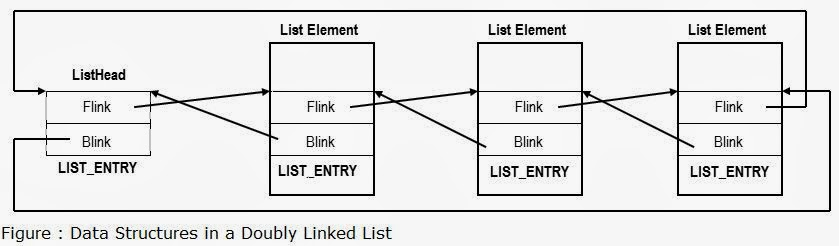
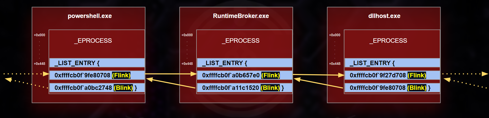
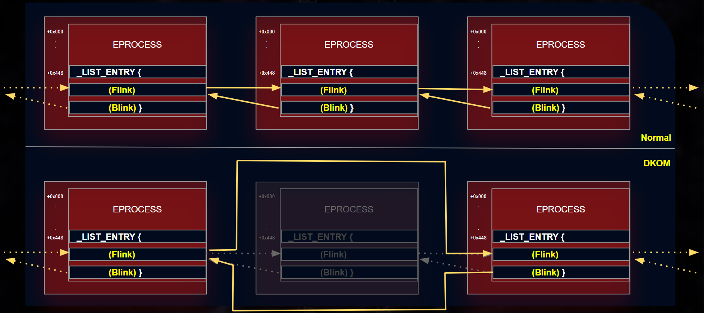

# Memory Forensics

Here are some types of data found in RAM that are valuable for incident investigation:

- `Network connections`
- `File handles and open Files`
- `Open registry keys`
- `Running processes on the system`
- `Loaded modules`
- `Loaded device drivers`
- `Command history and console sessions`
- `Kernel data structures`
- `User and credential information`
- `Malware artifacts`
- `System configuration`
- `Process memory regions`

when malware operates, it often leaves traces or footprints in a system's active memory. By analyzing this memory, investigators can uncover malicious processes, identify indicators of compromise, and reconstruct the malware's actions.

It should be noted that in some cases, important data or encryption keys may reside in memory. Memory forensics can help recover this data, which may be crucial for an investigation.

<aside>
💡

**Process Hollowing** is a stealthy malware injection technique where an attacker creates a legitimate process in a suspended state, removes its original code, and replaces it with malicious code before resuming execution. This allows the [malware](https://www.portnox.com/cybersecurity-101/what-is-fileless-malware/) to run under the guise of a legitimate process, evading detection by security tools.

only esse :[https://www.portnox.com/cybersecurity-101/what-is-process-hollowing/](https://www.portnox.com/cybersecurity-101/what-is-process-hollowing/)

full of info : [https://cysinfo.com/detecting-deceptive-hollowing-techniques/](https://cysinfo.com/detecting-deceptive-hollowing-techniques/)

</aside>

## **six-step memory forensics methodology:**

1. `Process Identification and Verification`: Let's begin by identifying all active processes. Malicious software often masquerades as legitimate processes, sometimes with subtle name variations to avoid detection. We need to:
    - Enumerate all running processes.
    - Determine their origin within the operating system.
    - Cross-reference with known legitimate processes.
    - Highlight any discrepancies or suspicious naming conventions.
2. `Deep Dive into Process Components`: Once we've flagged potentially rogue processes, our next step is to scrutinize the associated Dynamic Link Libraries (DLLs) and handles. Malware often exploits DLLs to conceal its activities. We should:
    - Examine DLLs linked to the suspicious process.
    - Check for unauthorized or malicious DLLs.
    - Investigate any signs of DLL injection or hijacking.
3. `Network Activity Analysis`: Many malware strains, especially those that operate in stages, necessitate internet connectivity. They might beacon to Command and Control (C2) servers or exfiltrate data. To uncover these:
    - Review active and passive network connections in the system's memory.
    - Identify and document external IP addresses and associated domains.
    - Determine the nature and purpose of the communication.
        - Validate the process' legitimacy.
        - Assess if the process typically requires network communication.
        - Trace back to the parent process.
        - Evaluate its behavior and necessity.
4. `Code Injection Detection`: Advanced adversaries often employ techniques like process hollowing or utilize unmapped memory sections. To counter this, we should:
    - Use memory analysis tools to detect anomalies or signs of these techniques.
    - Identify any processes that seem to occupy unusual memory spaces or exhibit unexpected behaviors.
5. `Rootkit Discovery`: Achieving stealth and persistence is a common goal for adversaries. Rootkits, which embed deep within the OS, grant threat actors continuous, often elevated, system access while evading detection. To tackle this:
    - Scan for signs of rootkit activity or deep OS alterations.
    - Identify any processes or drivers operating at unusually high privileges or exhibiting stealth behaviors.
6. `Extraction of Suspicious Elements`: After pinpointing suspicious processes, drivers, or executables, we need to isolate them for in-depth analysis. This involves:
    - Dumping the suspicious components from memory.
    - Storing them securely for subsequent examination using specialized forensic tools.

## Volatility

Some commonly used modules include:

- **`pslist`**: Lists the running processes.
- **`cmdline`**: Displays process command-line arguments
- **`netscan`**: Scans for network connections and open ports.
- **`malfind`**: Scans for potentially malicious code injected into processes.
- **`handles`**: Scans for open handles
- **`svcscan`**: Lists Windows services.
- **`dlllist`**: Lists loaded DLLs (Dynamic-link Libraries) in a process.
- **`hivelist`**: Lists the registry hives in memory.

You can find modules and their associated documentation using the following links:

- **Volatility v2**: [**https://github.com/volatilityfoundation/volatility/wiki/Command-Reference**](https://github.com/volatilityfoundation/volatility/wiki/Command-Reference)
- **Volatility v3**: [**https://volatility3.readthedocs.io/en/latest/index.html**](https://volatility3.readthedocs.io/en/latest/index.html)

A useful Volatility (v2 & v3) cheatsheet can be found here: [**https://blog.onfvp.com/post/volatility-cheatsheet/**](https://blog.onfvp.com/post/volatility-cheatsheet/)

## Volatility2

### **Identifying the Profile**

Profiles are essential for Volatility v2 to interpret the memory data correctly.

```jsx
vol.py -f path.vmem imageinfo
```

and then **always use `--profile=profileName` to specify the profile.**

### **Identifying Running Processes**

Let's see if the suggested `Win7SP1x64` profile is correct by trying to list running process via the `pslist` plugin.

### **Identifying Network Artifacts**

The `netscan` plugin can be used to scan for network artifacts as follows.

To find `_TCPT_OBJECT` structures using pool tag scanning, use the `connscan` command. This can **find artifacts from previous connections that have since been terminated**, in addition to the active ones.

### Identifying Injected Code

The `malfind` plugin can be used to identify and extract injected code and malicious payloads from the memory of a running process as follows.

<aside>
💡

To be checked
Sometimes the output is with alot of scripts, is it from different process or same one

</aside>

### Identifying Handles

The `handles` plugin in Volatility is used for analyzing the handles (file and object references) held by a specific process within a memory dump, it reveals the resources and objects a process is interacting with. **A Handle** is a logical association with a shared resource like a file, Window, memory location, etc. When a thread opens a file, it establishes a "handle" to the file, and internally it acts like a "name" for that instance of the file.

<aside>
💡

 The file “ process “ doesn't directly interact with the file's data on the disk. Instead, the process requests the operating system to open the file, and in return, the OS provides a file handle. This handle is essentially a ticket that grants the process permission to perform operations on that file. Every subsequent operation the process performs on that file - be it reading, writing, or closing - is done through this handle.

</aside>

```jsx
Bb16@htb[/htb]$ vol.py -f /home/htb-student/MemoryDumps/Win7-2515534d.vmem --profile=Win7SP1x64 handles -p ProcessID --object-type=Key|File|Process
```

### Identifiying Windows Services

The `svcscan` plugin in Volatility is used for listing and analyzing Windows services running
on a system within a memory dump. Here's how to use the `svcscan` plugin.

```jsx
vol.py -f /home/htb-student/MemoryDumps/Win7-2515534d.vmem --profile=Win7SP1x64 svcscan | more
```

### Identifying Loaded DLL

The `dlllist` plugin in Volatility is used for listing the dynamic link libraries (DLLs) loaded into the address space of a specific process within a memory dump. Here's how to use the `dlllist` plugin.

```jsx
vol.py -f /home/htb-student/MemoryDumps/Win7-2515534d.vmem --profile=Win7SP1x64 dlllist -p `Process id`
```

### Identifying Hives

The `hivelist` plugin in Volatility is used for listing the hives (registry files) present in the memory dump of a Windows system. Here's how to use the hivelist plugin.

```jsx
vol.py -f /home/htb-student/MemoryDumps/Win7-2515534d.vmem --profile=Win7SP1x64 hivelist
```

### Dump files

Using `dumpfiles` plugin.

```jsx
vol2 -f memory.raw --profile=Winxxxx dumpfiles -Q 0xADDRESS -D .
```

### **Rootkit Analysis with Volatility v2**

A rootkit is a set of tools that gives someone the highest privileges in a system, they are designed to hide their presence on your device. “ like ram rootkit, firmware rootkits etc “ [https://www.fortinet.com/resources/cyberglossary/rootkit](https://www.fortinet.com/resources/cyberglossary/rootkit)

### Understanding the EPROCESS Structure

[**EPROCESS**](https://www.nirsoft.net/kernel_struct/vista/EPROCESS.html) is a data structure in the Windows kernel that represents a process. Each running process in the Windows operating system has a corresponding `EPROCESS` block in kernel memory. During memory analysis, the examination of `EPROCESS` structures is crucial for understanding the running processes on a system, identifying parent-child relationships, and determining which processes were active at the time of the memory capture.

This structure is primarily used by the Windows operating system internally to manage processes, but for malware development or reverse engineering, it can be used to gain insight into process management in Windows. The `EPROCESS` structure is not meant to be used directly by user-mode applications but is exposed by certain system functions that allow interaction with the kernel.

### **FLINK and BLINK ( list bidirectionnelle circulaire )**

- **Flink** = Forward Link → pointer to the **next** element
- **Blink** = Backward Link → pointer to the **previous** element



Within the `EPROCESS` structure, we have `ActiveProcessLinks` as the doubly-linked list which contains the `flink` field and the `blink` field.

- **flink**: Is a forward pointer that points to the `ActiveProcessLinks` list entry of the `_next_ EPROCESS` structure in the list of active processes.
- **blink**: Is a backward pointer within the `EPROCESS` structure that points to the `ActiveProcessLinks` list entry of the `_previous_ EPROCESS` structure in the list of active processes.

These linked lists of EPROCESS structures are used by the Windows kernel to quickly iterate through all running processes on the system. The below diagram shows how this linked list looks like.



<aside>
💡

as a summary, all the windos processes are represented in the kernel into single global circular doubly-linked list with EPROCESS data strcuture .

</aside>

### Identifying Rootkit Signs

`Direct Kernel Object Manipulation (DKOM)` is a sophisticated technique used by rootkits and advanced malware to manipulate the Windows operating system's kernel data structures in order to hide malicious processes, drivers, files, and other artifacts from detection by security tools and utilities running in userland (i.e., in user mode).

If, for example, a monitoring tool is dependent on the `EPROCESS` structure for the enumeration of the running processes, and there's a rootkit running on the system which manipulates the `EPROCESS` structure directly in kernel memory by altering the `EPROCESS` structure or unlinking a process from lists, the monitoring tool will not be able to get the hidden process in the currently running processes list.

The below screenshot shows a graphical representation of how this unlinking actually works.



The `psscan` plugin is used to enumerate running processes. It scans the memory pool tags associated with each process's `EPROCESS` structure. This technique can help identify processes that may have been hidden or unlinked by rootkits, as well as processes that have been terminated but have not been removed from memory yet. This plugin can be used as follows.

```jsx
vol.py -f /home/htb-student/MemoryDumps/rootkit.vmem psscan
```

In the output below, we can see that the `pslist` plugin could not find `test.exe` which was hidden by a rootkit, but the `psscan` plugin was able to find it.

<aside>
💡

What is the difference between Psscan and Pslist?

The key difference between pslist and psscan is that **psscan uses pool-tag scanning to display processes**. This plugin can find previously terminated processes, as well as hidden or unlinked processes, which could be hiding malicious software or activity

</aside>

- Simple explaination
    
    ## 1) The train yard (how Windows keeps processes)
    
    - Every running program = **one train carriage** (a little box called `_EPROCESS`).
    - Windows keeps all carriages linked together on **one big circular track** called `PsActiveProcessHead`.
        - Each carriage has two couplers: **front (Flink)** and **back (Blink)** so it links to the next and previous carriage.
    - **Task Manager** and many tools look at this track to see which carriages (processes) are on it.
    
    ---
    
    ## 2) What happens when a new process starts
    
    - Windows makes a new carriage (creates `_EPROCESS`) and attaches it to the track.
    - Now Task Manager will see it, because it looks at the track.
    
    ---
    
    ## 3) Hiding a process is like removing a carriage from the track
    
    - A **kernel rootkit** (bad code that runs with special powers) can **unlink** a carriage it disconnects the front and back couplers so the carriage is no longer on the track.
    - But the carriage still exists in the yard! It still has passengers, wheels, and maybe even running engines (threads). It’s just not attached to the main track anymore.
    - Because normal tools only look at the track, they **won’t see** that unlinked carriage the process is hidden.
    
    ---
    
    ## 4) Why `psscan` can still find it (the yard walker)
    
    - `psscan` doesn’t just look at the track. It **walks around the whole yard**, looking for anything that looks like a carriage: shape, windows (fields like PID, name), etc.
    - So even if a carriage was removed from the track, `psscan` can find it on the ground because it inspects raw memory for `_EPROCESS` shapes.
    - In short:
        - `pslist` / Task Manager = looks **only at the track**.
        - `psscan` = walks the **entire yard** and points out carriages not on the track.
    
    ---
    
    ## 5) Can a normal (user) program unlink carriages?
    
    - No. Only code that can touch the tracks (kernel-mode code — drivers or exploits) can unlink carriages. Regular user programs don’t have that power.
    
    ---
    
    ## 6) One more tiny worry: false alarms
    
    - Sometimes the yard-walker (`psscan`) might think a random object looks like a carriage when it isn’t (a false positive). That’s why tools also check a few more things (is the PID sensible? does the name look right?) before saying “this is a process.”
    
    ---
    
    ## Short kid-friendly summary
    
    - Processes = carriages.
    - `ActiveProcessLinks` = the main track that shows all carriages.
    - Hiding = removing a carriage from the track (carriage stays in the yard).
    - `pslist` = looks at the track (misses hidden carriages).
    - `psscan` = walks the yard and finds hidden carriages.

### MFT parser

This plugin scans for potential Master File Table (MFT) entries in memory (using "FILE" and "BAAD" signatures) and prints out information for certain attributes.

```jsx
vol.py -f memory.dmp --profile=ProfileName mftparser 
```

### Identify recently accessed file

`iehistory` plugin recovers fragments of IE history index.dat cache files. It can find basic accessed links (via FTP or HTTP), redirected links (--REDR), and deleted entries (--LEAK). It applies to any process which loads and uses the wininet.dll library, not just Internet Explorer. Typically that includes Windows Explorer and even malware samples. 

```jsx
vol.py -f memory.dmp --profile=ProfileName  iehistory
```

## Memory Analysis Using Strings

### Identifying Ip Addresses

```jsx
strings /home/htb-student/MemoryDumps/Win7-2515534d.vmem | grep -E "\b([0-9]{1,3}\.){3}[0-9]{1,3}\b"
```

powershell :

```jsx
& 'C:\tools\strings.exe' 'C:\dumps\Win7-2515534d.vmem' |
  Select-String -Pattern '\b([0-9]{1,3}\.){3}[0-9]{1,3}\b' |
  ForEach-Object { $_.Line }

```

### Identifying Email Addresses

```jsx
strings /home/htb-student/MemoryDumps/Win7-2515534d.vmem | grep -oE "\b[AZa-z0-9._%+-]+@[A-Za-z0-9.-]+\.[A-Za-z]{2,4}\b"
```

powershell :

```jsx
& 'C:\Path\To\strings.exe' 'C:\MemoryDumps\Win7-2515534d.vmem' | 
Select-String -Pattern '\b[A-Za-z0-9._%+-]+@[A-Za-z0-9.-]+\.[A-Za-z]{2,4}\b' 
```

### Identifying Commands Prompt or PowerShell Artifacts

```jsx
strings /home/htb-student/MemoryDumps/Win7-2515534d.vmem | grep -E "(cmd|powershell|bash)[^\s]+"
```

powershell:

```jsx
& 'C:\Path\To\strings.exe' 'C:\MemoryDumps\Win7-2515534d.vmem' |
Select-String -Pattern '(cmd|powershell|bash)[^\s]+' 
```

## tips

<aside>
💡

Powershell scripts to use volatility3 in every place not just inside its folder:

```jsx
function vol3 {
    & "D:\Tools\volatility3\venv\Scripts\python.exe" "D:\Tools\volatility3\vol.py" @args
}
```

then run this and paste the same function and save.

because everytime you open powershell this file is going to run automaticly as well **PROFILE**

```jsx
notepad $PROFILE
```

</aside>

- [ ]  Check volatility community plugins

<aside>
💡

**To use externel community plugins** :

- download `.py` of the plugin
- copy it inside volatility \plugins
- run vol2 but add the - - plugins path

example :

```jsx
 vol2 --plugins=D:\Tools\volatility2.6\volatility\plugins -f .\MemoryDump_Lab6.raw --profile=Win7SP1x64 networkpackets --dump-dir .
```

</aside>

## Community Plugins

- networkpackets : for network scans and identify addresses etc

[uninstallinfo.py](http://uninstallinfo.py/) - Dumps HKLM\SOFTWARE\Microsoft\Windows\CurrentVersion\Uninstall from memory

[prefetch.py](http://prefetch.py/) - scan memory for prefetch files and dump filename and timestamps

[idxparser.py](http://idxparser.py/) - scan memory Java IDX files and extract details

[firefoxhistory.py](http://firefoxhistory.py/) - firefoxhistory, firefoxcookies, and firefoxdownloads plugins to extract the following firefox history data: moz_places, moz_cookies, and moz_downloads

[chromehistory.py](http://chromehistory.py/) - chromehistory, chromevisits, chromesearchterms, chromedownloads, chromedownloadchains, and chromecookies plugins to extract Chrome SQLite artifacts

sqlite_help.py - supporting functions SQLite used in Firefox and Chrome plugins

[trustrecords.py](http://trustrecords.py/) - extract Office TrustRecords registry key information

[ssdeepscan.py](http://ssdeepscan.py/) - like yarascan, but searches for pages matching an ssdeep hash

[malfinddeep.py](http://malfinddeep.py/) - whitelist code found by malfind based on an ssdeep hash

[apihooksdeep.py](http://apihooksdeep.py/) - whitelist code found by apihooks based on an ssdeep hash

# Ideas from our last challenge

## Q7 : How many processes are associated with VCRUNTIME140.dll?

- When they ask about content of a process, use memdump instead of procdump sometimes because it dumps **raw physical pages** with no high-level OS interoretation.

| Plugin | Trusts OS structures? | Sees hidden pages? |
| --- | --- | --- |
| procdump | Yes | No |
| memdump | No | Yes |

## Q10 : What memory protection constants does the VAD node at 0xfffffa800577ba10 have?

## Q11 : What memory protection did the VAD starting at 0x00000000033c0000 and ending at 0x00000000033dffff have?

`vadinfo` : shows you the **memory map of a process,** every memory region it owns, with its **permissions and type**.

- What is Virtual Address Descriptor “ **VAD** “
    
    ## 1. What is a VAD (in simple terms)
    
    A **VAD** is a **kernel data structure** Windows uses to track:
    
    > *Every memory region allocated by a process.*
    > 
    
    Think of it as a **map of a process’s virtual memory**.
    
    For each chunk of memory, Windows stores:
    
    - Start address
    - End address
    - Size
    - Type (image, private, mapped)
    - **Permissions (protection flags)**
    
    So a process is basically:
    
    ```
    Process
     └── VAD tree
          ├── Stack
          ├── Heap
          ├── DLLs
          ├── Memory-mapped files
          └── Injected regions
    ```
    
    ---
    
    ## 2. Why Windows uses VADs
    
    The OS needs VADs to:
    
    - Know which memory is **valid**
    - Enforce **read/write/execute permissions**
    - Handle **page faults**
    - Manage **memory-mapped files**
    - Prevent illegal access
    
    Without VADs, Windows couldn’t answer:
    
    > “Is this address legal for this process?”
    > 
    
    ---
    
    ## 3. Memory protection constants (the key part)
    
    Each VAD has **protection flags**, like:
    
    | Flag | Meaning |
    | --- | --- |
    | `PAGE_READONLY` | Can read |
    | `PAGE_READWRITE` | Can read + write |
    | `PAGE_EXECUTE` | Can execute |
    | `PAGE_EXECUTE_READWRITE` | RWX (dangerous) |
    | `PAGE_NOACCESS` | Should not be touched |
    
    This is Windows’ equivalent of:
    
    ```bash
    rwx
    ```
    
    ---
    
    ## 4. Why VAD is gold in forensics
    
    Because **malware must live somewhere in memory**.
    
    And wherever it lives:
    
    - it must have a VAD
    - with permissions
    - and a type
    
    So VAD lets you answer:
    
    - Is this memory **code or data?**
    - Is it **mapped from disk or injected?**
    - Is it **executable but not from a file?** ← huge red flag
    
    ## 5. Typical malicious patterns
    
    ### 1. RWX memory
    
    ```
    PAGE_EXECUTE_READWRITE
    ```
    
    Means:
    
    > Memory that can be modified AND executed.
    > 
    
    This almost never exists in clean software.
    
    ---
    
    ### 2. Private executable memory
    
    ```
    Type:PrivateProtection: PAGE_EXECUTE_READWRITE
    ```
    
    Means:
    
    > Code that does NOT come from any file on disk.
    > 
    
    This is classic:
    
    - shellcode
    - reflective DLL
    - in-memory loader
    - process injection
    
    ---
    
    ### 3. Mismatch with disk
    
    DLL loaded in memory but:
    
    - no file path
    - or hash doesn’t match disk
    
    → fileless malware.
    
    ---
    
    ## 6. What VAD analysis gives you
    
    From VAD alone you can detect:
    
    | Technique | Seen in VAD |
    | --- | --- |
    | Process injection | Private executable VAD |
    | Reflective DLL | Executable but no file |
    | Hollowing | Image VAD replaced |
    | Shellcode | Small RWX region |
    | Fileless malware | No backing file |
