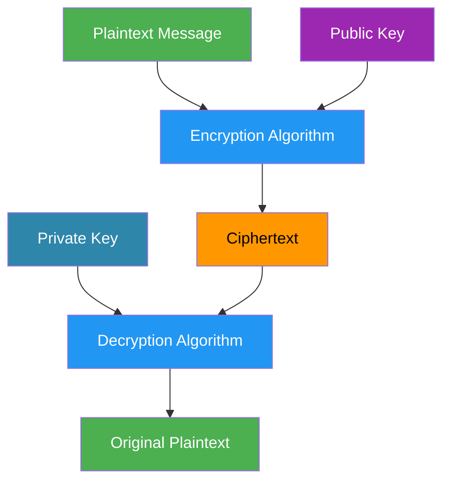
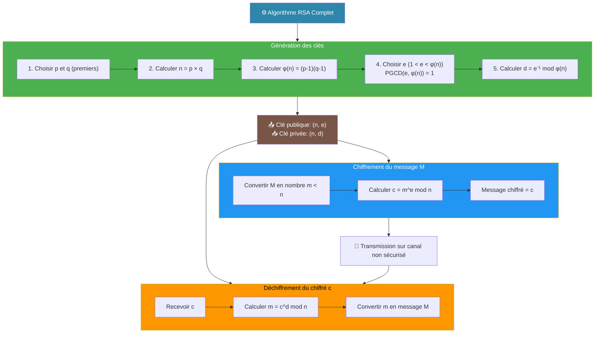
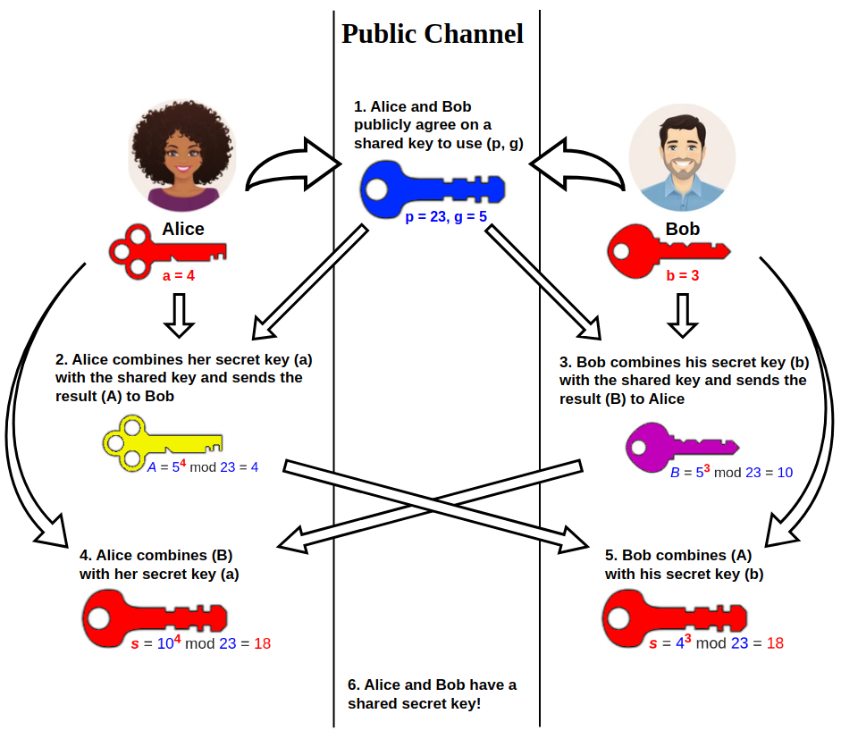
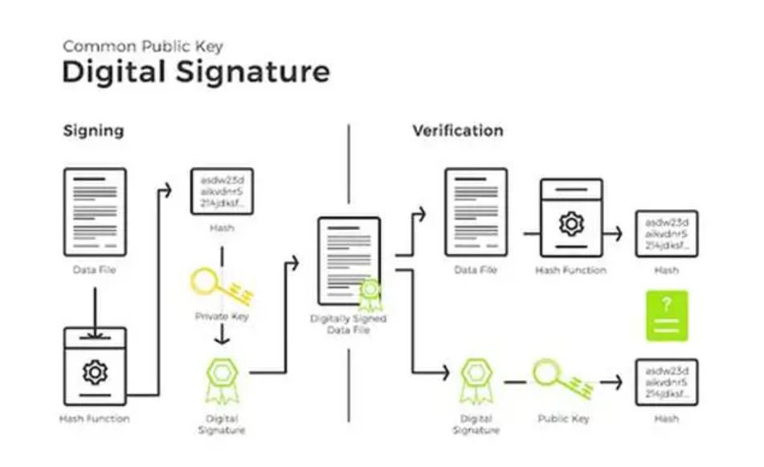

# Introduction to Cryptography (PART 2)

## Asymmetric cryptography 

Asymmetric Cryptography uses two different keys:
- a public key (can be shared with everyone)
- a private key (kept secret)

One key encrypts, the other decrypts. This solves the key sharing problem of symmetric ciphers.

It’s widely used to **secure communication over open networks**, like the Internet.



#### Key Characteristics:
- Uses two different keys: public & private
- Public key can be shared openly
- Private key must be kept secret
- Slower than symmetric encryption
- Excellent for secure key exchange and small messages
- Often combined with symmetric encryption for efficiency


### RSA (Rivest-Shamir-Adleman)

RSA invented in 1977 by three researchers: Ron Rivest, Adi Shamir, and Leonard Adleman at MIT. It is a widely used asymmetric encryption algorithm for securing communications.
RSA uses two keys: a public key to encrypt and a private key to decrypt.

It’s based on simple yet powerful math: multiplying large prime numbers and modular exponentiation.

#### Key Features

| Feature | Description |
|---------|-------------|
|Key type|Asymmetric (public & private)|
|Block size|Depends on key size (e.g., 1024, 2048 bits)|
|Security|Hard to factor large numbers|
|Use|Encrypting small messages or symmetric keys|

#### How RSA Works
**Generate Keys**

- Choose two prime numbers p and q
- Compute n = p × q (used in both public & private keys)
- Compute φ(n) = (p−1)(q−1)
- Choose e (public exponent) coprime with φ(n)
- Compute d (private exponent) such that e × d ≡ 1 mod φ(n)

**Encryption**
- Convert the message into a number m (< n)
- Compute the ciphertext:
``` c = m^e mod n ```

**Decryption**
- Compute the message:
``` m = c^d mod n ```
- Only the private key d can recover m




### Diffie-Hellman Key Exchange (DH)
Diffie-Hellman (DH) is a protocol that allows two parties to create a shared secret over an insecure channel, without ever sending the secret itself.

It is based on simple but powerful math: modular exponentiation and the difficulty of the discrete logarithm problem.

#### Key Features
|Feature|Description|
|-------|-----------|
|Type|Key exchange / asymmetric|
|Security|Hard to solve the discrete logarithm problem|
|Use| Securely sharing symmetric keys over a network|

#### How Diffie-Hellman Works
**Agree on Public Parameters**
- Choose a large prime number p
- Choose a primitive root g modulo p
- Both p and g are public

**Generate Private & Public Keys**
- Alice chooses a private key a (secret)
- Bob chooses a private key b (secret)
- Compute public keys:
    + Alice: ```A = g^a mod p```
    + Bob: ```B = g^b mod p```
- Exchange public keys (A and B) over the network

**Compute Shared Secret**
- Alice computes: ```s = B^a mod p```
- Bob computes: ```s = A^b mod p```

Note: a and b should be < p  
```a<p and b<p```




---

## Hashing & Password Security

A hash function is a special kind of function that takes any input (message, file, password) and produces a fixed-size output, called the hash or digest.

Hash functions are widely used in cryptography, especially for data integrity and password storage.

#### Key Features
|Feature|Description|
|-------|-----------|
|Output size|Fixed length (e.g., 256 bits for SHA-256)|
|Deterministic|Same input → same hash|
|Fast|Quickly computes the hash|
|One-way|Cannot reverse to get the input|
|Collision-resistant|Hard to find two inputs with the same hash|

#### How Hashing Works
- Take Input → Any size (text, file, message)
- Process with Hash Function → Internal operations like bit mixing, modular additions, shifts
- Output Hash → Fixed-size digest

```Example 1: 
Input: "Hello World"
SHA-256 Hash: a591a6d40bf420404a011733cfb7b190d62c65bf0bcda32b57b277d9ad9f146e
```

```Example 2:
Input: "Cyber Security"
SHA-256 Hash: 805e20cf7c3f85210a1b22b68895e2f7edff2cf1565bb685b77f87a3126db27e
```

#### Properties of Cryptographic Hash Functions
- **Deterministic:** The same input always gives the same hash.
- **Quick to compute:** Efficient for any size input.
- **Preimage resistance:** Impossible to recover the original input from the hash.
- **Collision resistance:** Extremely difficult to find two different inputs with the same hash.
- **Avalanche effect:** A tiny change in input drastically changes the hash.


#### Popular Hash Functions
|Algorithm|Output Size|Notes|
|---------|-----------|-----|
|MD5|128 bits|Fast but broken for collisions|
|SHA-1|160 bits|Considered weak, avoid for security|
|SHA-256|256 bits|Modern, secure, widely used|
|SHA-3|256/512 bits|Newer standard, very secure|


### Rainbow Tables (Hash Attacks)
Even though hash functions are one-way, attackers found a way to exploit weak password choices.

A rainbow table is a large precomputed database:
- Plaintext password → corresponding hash

Instead of cracking hashes one by one, an attacker:
- Takes a stolen hash
- Looks it up in the rainbow table
- Instantly finds the original password (if it exists)

#### Why Rainbow Tables Work
- Many users choose common passwords
- Hash functions always produce the same output
- No randomness → same password = same hash

### Salt
A salt is a random value added to a password before hashing.

The goal of a salt is not to hide the password, but to make attacks much harder.

#### Why Salt Is Needed
- Hash functions always produce the same output for the same input.
- Without salt:
    + Same password → same hash
    + Attackers can use precomputed tables to crack passwords fast
- With salt:
    + Same password → different hash
    + Precomputed attacks become useless

#### Important Facts About Salt
- A salt does not need to be secret
- It is stored in the database next to the hash
- Each user should have a unique salt
- Longer and random salts are safer

#### What Salt Protects Against
- Rainbow table attacks
- Mass password cracking
- Identical hashes for identical passwords


### Digital Signatures & Integrity
Signature ≠ Encryption

Encryption = keep message secret

Signature = prove message came from you + not modified

Works with asymmetric crypto (RSA, ECC…)

#### How It Works
- Take the message → compute a hash
- Encrypt the hash with your private key → this is the digital signature
- Send message + signature

**Receiver:**
- Compute hash of received message
- Decrypt signature with sender’s public key
- Compare → match = message is authentic & unmodified

Math intuition: hash + private key = unique proof

**eal-World Examples**
- Git commits → signed to prove author & integrity
- Software updates → ensure downloaded updates are genuine
- Emails / documents → verify origin & integrity

**Key Takeaways**
- Signature proves origin + integrity
- Uses hash + asymmetric encryption
- Changing even 1 bit → signature fails
- Public key = anyone can verify, Private key = only signer can sign



---
by: mrm_aya <3
