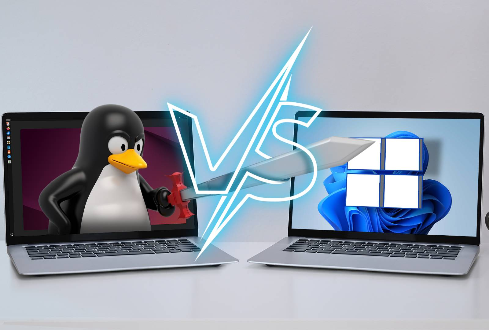
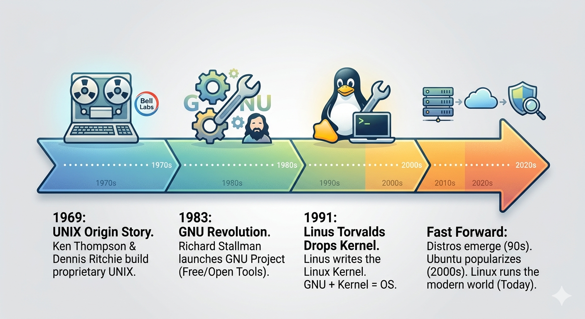
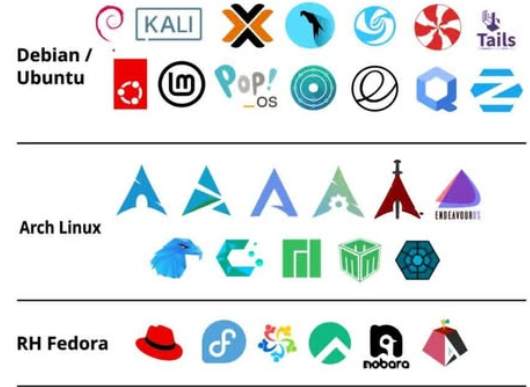
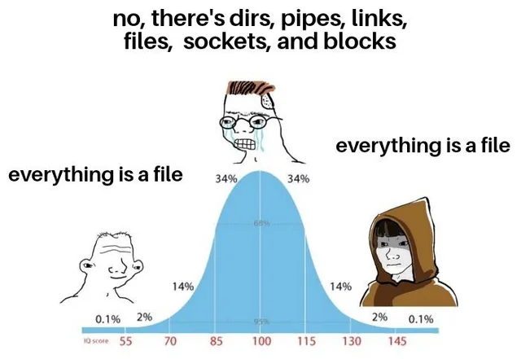
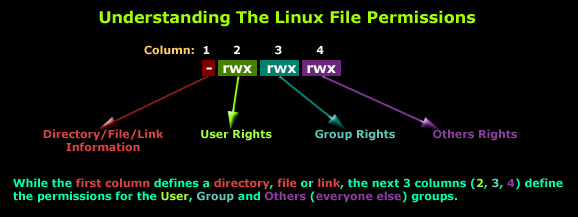
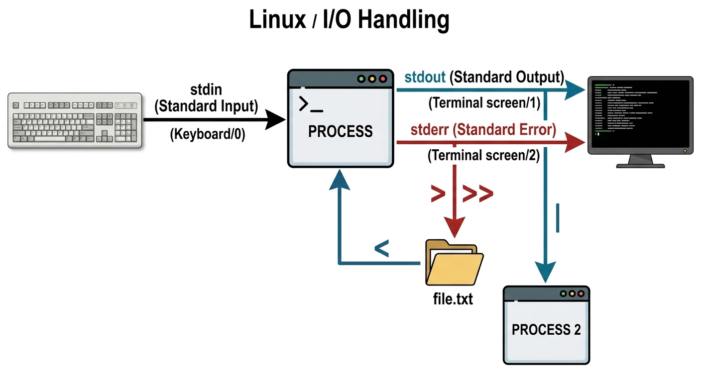

## 1. Defining Linux
### What even *is* Linux?
- **Linux is an operating system kernel**, the core layer between your hardware and your software
- It was designed to be **free, open-source, and UNIX-like**
- What most people call "Linux" is actually a **full OS distribution** built *around* the Linux kernel
---
### What Linux powers today
- **+95%** of the world's top web servers
- **Android** (yes, it's Linux under the hood)
- Most cloud infrastructure (AWS, GCP, Azure VMs)
- Almost every **hacking/pentesting** platform out there
- The **International Space Station**

> If you're doing anything serious in cybersecurity, you *will* be using Linux.
---

## 2. Linux vs Windows
### Picking the right tool for the job


### Key Differences
| Feature                | Linux                        | Windows                    |
| ---------------------- | ---------------------------- | -------------------------- |
| **Cost**               | Free & Open Source           | Paid (licensing)           |
| **Customization**      | Extremely high               | Limited                    |
| **Security model**     | Permissions-first            | Often user-first           |
| **CLI power**          | Native, powerful             | Bolted on (PowerShell/WSL) |
| **Software ecosystem** | Dev/server-focused           | Consumer/enterprise        |
| **Attack surface**     | Smaller (if configured well) | Historically larger        |
| **Minimum Hardware Specs** | Can run on 2008 PCs          | May God be with us         |
### When to choose Linux
- Running a **server or service**
- Doing **pentesting or security research**
- **Privacy-focused** computing
- Working in a **DevOps / cloud** environment
- You want to actually *understand* your machine
### When to choose Windows
- Enterprise environments with **Active Directory**
- Using **Windows-specific software** (Adobe, some games, Office natively)
- Target environment for a **red team engagement** you're studying

> <b><u>Note</u></b>: In security we'll need to use/understand both.
---
## 3. History & Lore
### How we got here

---
### The UNIX Origin Story (1969)
- **Bell Labs** (AT&T), Ken Thompson & Dennis Ritchie build **UNIX**
- Designed for portability, multitasking, multi-user support
- Became the gold standard OS in academia and research
- But it was **proprietary**, you couldn't freely use or modify it
---
### The GNU Revolution (1983)
- **Richard Stallman** launches the **GNU Project**, *"GNU's Not Unix"*
- Goal: build a completely **free and open** UNIX-like OS
- GNU produced tons of essential tools: `gcc`, `bash`, `grep`, `ls`...
- But it was missing one thing: **a kernel**
---
### Linus Torvalds Drops the Kernel (1991)
> *"I'm doing a (free) operating system (just a hobby, won't be big and professional like gnu)"*
>Linus Torvalds, [in a Usenet post, August 1991](https://community.cadence.com/cadence_blogs_8/b/breakfast-bytes/posts/i-m-doing-an-operating-system-just-a-hobby-won-t-be-big-and-professional)

- **Linus Torvalds**, a 21-year-old Finnish student, writes the **Linux kernel**
- Combined with GNU tools → the first real **GNU/Linux OS** is born
- Released under the **GPL license**, free forever, modifications must stay open
---
### Fast Forward
- **1990s:** Distros emerge, Slackware, Debian, Red Hat
- **2000s:** Ubuntu brings Linux to the masses
- **2004:** Kali's ancestor (BackTrack) targets security professionals
- **Today:** Linux runs the modern internet, the cloud, and your hacking lab
---
## 4. Linux Distributions
### One kernel, infinite flavors



> <b><u>Note</u></b>: For a more complete chart, check [this link](https://commons.wikimedia.org/wiki/File:Linux_Distribution_Timeline.svg).
---
### What is a Distro?
- A **Linux distribution** = Linux kernel + software packages + package manager + desktop environment (optional)
- Think of it like: same engine, totally different cars
- There are **600+** active distros (Ubuntu, Debian, Kali Linux, ...), each built for a purpose
---
### The Heavy Hitters
| Distro | Based On | Best For |
|---|---|---|
| **Ubuntu** | Debian | General use, beginners, servers |
| **Debian** |. | Stability, servers |
| **Kali Linux** | Debian | Offensive security / pentesting |
| **Parrot OS** | Debian | Security + privacy + dev |
| **Arch Linux** |. | Power users, full control |
| **Fedora** | Red Hat | Cutting-edge desktop |
| **CentOS / RHEL** | Red Hat | Enterprise servers |
| **Tails** | Debian | Anonymity & privacy |
## 5. Linux File Hierarchy
### The filesystem you need to memorize


---
### Everything starts at `/`
- Linux has **no drive letters** (no `C:\`), there's a single root: `/`
- Every file and directory lives under it
- **Mounting** attaches other devices/partitions into this tree
---
### The Key Directories
| Directory         | What lives there                                 |
| ----------------- | ------------------------------------------------ |
| `/`               | Root of everything                               |
| `/home`           | User home directories (`/home/alice`)            |
| `/root`           | Home directory for the **root user**             |
| `/etc`            | **System configuration files**                   |
| `/var`            | Variable data, logs, mail, databases             |
| `/tmp`            | Temporary files (wiped on reboot)                |
| `/bin`            | Essential user binaries (`ls`, `cp`, `cat`)      |
| `/sbin`           | System binaries (for root/admins)                |
| `/usr`            | User programs and libraries                      |
| `/lib`            | Shared libraries                                 |
| `/dev`            | **Device files** (disks, terminals, etc.)        |
| `/proc`           | **Virtual filesystem**, live kernel/process info |
| `/sys`            | Virtual filesystem, hardware/kernel data         |
| `/mnt` / `/media` | Mount points for external drives                 |
| `/opt`            | Optional/third-party software                    |
## 6. Linux Philosophies
### The soul of the OS


---
### The Unix Philosophies
> *"Write programs that do one thing and do it well."*
> *"Write programs to work together."*
> *"Write programs that handle text streams, because that is a universal interface."*
>, Doug McIlroy (Bell Labs)

- **Do one thing well**, tools are focused (`grep` searches, `cut` slices, `sort` sorts)
- **Compose tools**, pipe them together to build power
- **Text is the universal interface**, almost everything reads/writes plain text
---
### "Everything is a File"
This is the big one. In Linux, almost **everything is represented as a file**:

| Thing                   | File Path                       |
| ----------------------- | ------------------------------- |
| Hard drive              | `/dev/sda`                      |
| USB stick               | `/dev/sdb`                      |
| Your keyboard           | `/dev/input/event0`             |
| A running process       | `/proc/[PID]/`                  |
| Network socket          | (file descriptor under `/proc`) |
| System temperature      | `/sys/class/thermal/...`        |
| Random number generator | `/dev/random`                   |
| A black hole for output | `/dev/null`                     |

> This is why Linux is so powerful, you can read, write, and manipulate almost anything using standard file tools.

Some examples:

```bash
cat /dev/urandom | head -c 32 | xxd     # A device that generates random bytes

echo "this goes nowhere" > /dev/null    # The void, /dev/null

# Your entire process is a bunch of files
echo $$           # Current shell PID
ls /proc/$$       # That process's directory
cat /proc/$$/status

# CPU info from the virtual fs
cat /proc/cpuinfo | grep "model name" | head -1

# Memory info
cat /proc/meminfo | head -5

# Read from /dev/urandom to generate a random-looking password
cat /dev/urandom | tr -dc 'a-zA-Z0-9' | head -c 16; echo
```
---
## 7. Basic Commands in Linux
### **Navigation**
* **`pwd`**: Prints your current working directory (where you are).
* **`ls`**: Lists files and folders. Common flags: `-l` (details), `-a` (hidden files), and `-h` (readable sizes).
* **`cd`**: Changes your directory. Use `~` for home, `..` to go up one level, and `-` to go back to the last folder.
---
### **File Operations**
* **`cat`**: Reads and displays the entire content of a file in the terminal.
* **`cp`**: Copies files or directories (use `-r` to copy folders).
* **`mv`**: Moves or renames files and folders.
* **`rm`**: Deletes files. Use `-r` for folders and `-rf` for a forced delete (use with extreme caution).
* **`mkdir`**: Creates a new, empty directory.
* **`touch`**: Creates a new, empty file.
---
### **Text & Search**
* **`grep`**: Searches for specific text within files.
* **`find`**: Searches for files and directories based on names, types, or permissions.
* **`man`**: Opens the "manual" for any command to show you how to use it (press **q** to exit).
## 8. Linux Permissions
### The UGO-RWX Model

---
### The Permission String
When you run `ls -l`, you see something like:
```
-rwxr-xr--  1  alice  devs  4096  Mar 10 14:00  script.sh
```

Let's break it down:
```
- rwx r-x r--
│ │   │   └─── Others: read only
│ │   └─────── Group: read + execute
│ └─────────── Owner: read + write + execute
└───────────── File type: - = file, d = directory, l = symlink
```
---
### The Three Identities (UGO)
| Letter | Identity     | Meaning                               |
| ------ | ------------ | ------------------------------------- |
| **U**  | User (Owner) | The person who owns the file          |
| **G**  | Group        | A group of users assigned to the file |
| **O**  | Others       | Everyone else                         |
### The Three Permissions (RWX)
| Letter | Permission | On a File | On a Directory |
|---|---|---|---|
| **r** | Read | View contents | List directory |
| **w** | Write | Modify contents | Create/delete files inside |
| **x** | Execute | Run as program | Enter the directory (`cd`) |
| **-** | None | Denied | Denied |
### Changing Permissions, `chmod`
#### Symbolic mode
```bash
chmod u+x script.sh        # give owner execute
chmod g-w file.txt         # remove write from group
chmod o+r file.txt         # give others read
chmod a+x script.sh        # give all (a) execute

```
#### Numeric (Octal) mode
```
r = 4,  w = 2,  x = 1
```

| Octal | Binary | Meaning |
| ----- | ------ | ------- |
| 7     | 111    | rwx     |
| 6     | 110    | rw-     |
| 5     | 101    | r-x     |
| 4     | 100    | r--     |
| 0     | 000    | ---     |

```bash
chmod 755 script.sh    # Owner: rwx, Group: r-x, Others: r-x
chmod 644 file.txt     # Owner: rw-, Group: r--, Others: r--
chmod 600 secret.txt   # Owner: rw-, Group: ---, Others: ---
```
---
### Changing Ownership, `chown`
```bash
chown alice file.txt              # change owner to alice
chown alice:devs file.txt         # change owner and group
chown -R alice /home/alice/       # recursive
```
---
## 9. I/O Handling in Linux
### Redirect, pipe, and control the flow

---
### The Three Standard Streams
| Stream | Number | Default |
|---|---|---|
| **stdin** (Standard Input) | 0 | Keyboard |
| **stdout** (Standard Output) | 1 | Terminal screen |
| **stderr** (Standard Error) | 2 | Terminal screen |
### The Operators
#### `>`, Redirect stdout (overwrite)
```bash
echo "hello" > output.txt       # writes "hello" to file (overwrites)
ls -la > filelist.txt
```

#### `>>`, Redirect stdout (append)
```bash
echo "line 1" > log.txt
echo "line 2" >> log.txt        # appends, doesn't overwrite
cat log.txt
```

#### `<`, Redirect stdin
```bash
sort < unsorted.txt             # feed file content as input to sort
wc -l < notes.txt               # count lines in file
```

#### `2>`, Redirect stderr
```bash
find / -name "flag" 2>/dev/null         # discard error messages
find / -name "flag" 2>errors.txt        # save errors to file
```

#### `&>`, Redirect both stdout and stderr
```bash
command &> all_output.txt
```
---
### `|`, The Pipe (the star of the show)
A pipe takes the **output of one command** and feeds it as the **input of the next**. This is where Unix philosophy really shines.

```bash
# Who are the users with a real shell?
cat /etc/passwd | grep "/bin/bash"

# How many running processes?
ps aux | wc -l

# Find the 5 biggest files in /var/log
du -sh /var/log/* 2>/dev/null | sort -rh | head -5

# Search for a specific error in logs
cat /var/log/syslog | grep "error" | tail -20

# Chain: find → grep → count
find /etc -type f 2>/dev/null | grep ".conf" | wc -l
```
---
### `&`, Background Execution
```bash
sleep 60 &          # run in background, get your prompt back
jobs                # see background jobs
fg                  # bring back to foreground
```
---
### Bonus: `&&` and `||`
```bash
# Run second command ONLY if first succeeds
mkdir newdir && cd newdir

# Run second command ONLY if first fails
ping -c1 google.com || echo "No internet!"
```
---
## 10. 🏴 CTF Time, OverTheWire: Bandit