# IP Addressing and Subnetting Guide

## 1. What is an IP Address?

An **IP Address** (Internet Protocol Address) is a unique numerical label assigned to each device connected to a computer network. Think of it as a digital home address that allows devices to find and communicate with one another.

### IPv4 vs. IPv6

**IPv4**: The most common format. It consists of four numbers (octets) separated by dots (e.g., `192.168.1.1`). It uses a 32-bit address space, allowing for about 4.3 billion addresses.

**IPv6**: Created because we ran out of IPv4 addresses. It uses hexadecimal digits and looks like `2001:0db8:85a3:0000:0000:8a2e:0370:7334`.

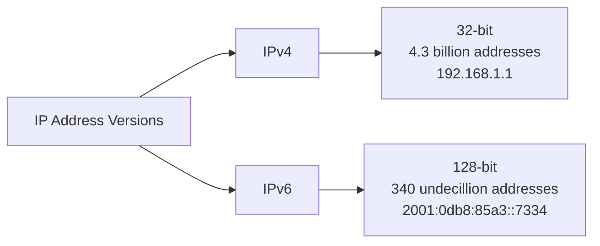

---

## 2. Public vs. Private (Local) IP Addresses

Not all IP addresses are visible to the entire internet. We categorize them based on their scope.

### Public IP Address

This is the address assigned to your network router by your Internet Service Provider (ISP). It is how the "outside world" identifies your home or office network.

### Private (Local) IP Address

These are used within an internal network (like your home Wi-Fi). Devices like your laptop, phone, and smart fridge each have a private IP to talk to the router and each other.

**Common Local Ranges:**
- `192.168.x.x`
- `10.x.x.x`
- `172.16.x.x` to `172.31.x.x`

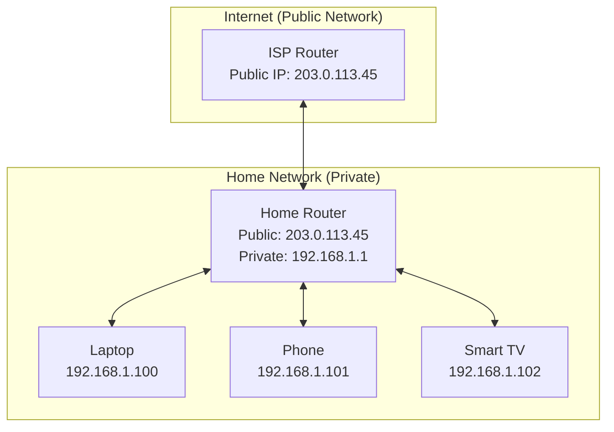

**Key Concept**: **NAT (Network Address Translation)** is the process your router uses to "map" multiple private local IPs to a single public IP so they can all access the internet.

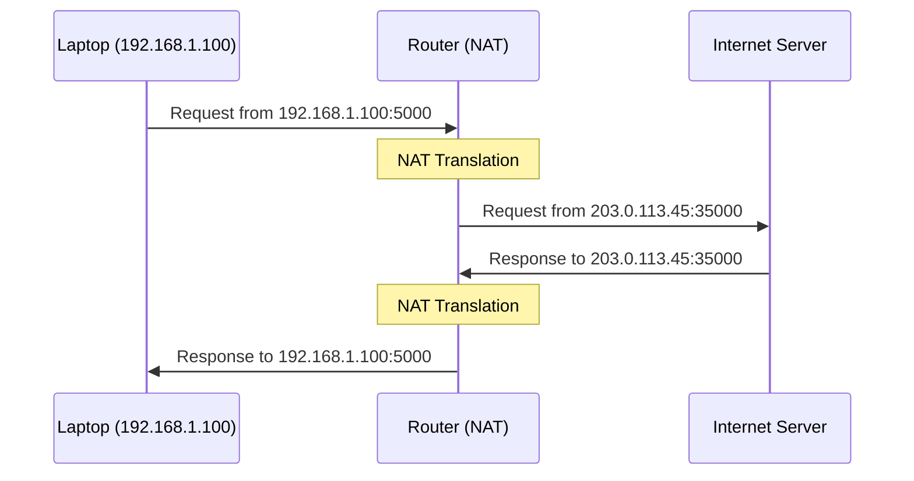

---

## 3. Static vs. Dynamic IP Addresses

This refers to how the address is assigned to the device.

| Feature | Dynamic IP | Static IP |
|---------|-----------|-----------|
| **Assignment** | Assigned automatically by a DHCP server | Manually configured and stays the same |
| **Persistence** | Can change every time you reconnect | Never changes |
| **Use Case** | Standard for home devices, phones, and PCs | Servers, printers, and hosting websites |
| **Cost/Effort** | Low maintenance, usually free | Often costs extra from ISPs; requires manual setup |

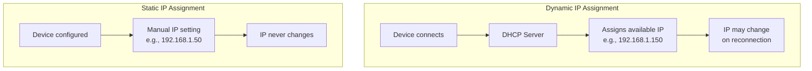

---

## 4. IP Address Classes (The Legacy System)

Historically, IP addresses were divided into five classes to help manage network sizes. While we largely use "Classless" routing today, understanding classes is vital for the basics.

| Class | Range (First Octet) | Default Subnet Mask | Purpose |
|-------|---------------------|---------------------|---------|
| **A** | 1 – 126 | `255.0.0.0` | Large networks (Millions of hosts) |
| **B** | 128 – 191 | `255.255.0.0` | Medium networks |
| **C** | 192 – 223 | `255.255.255.0` | Small networks (Home/Small Biz) |
| **D** | 224 – 239 | N/A | Multicasting |
| **E** | 240 – 255 | N/A | Experimental/Research |

**Note**: `127.x.x.x` is reserved for Loopback (testing your own machine).

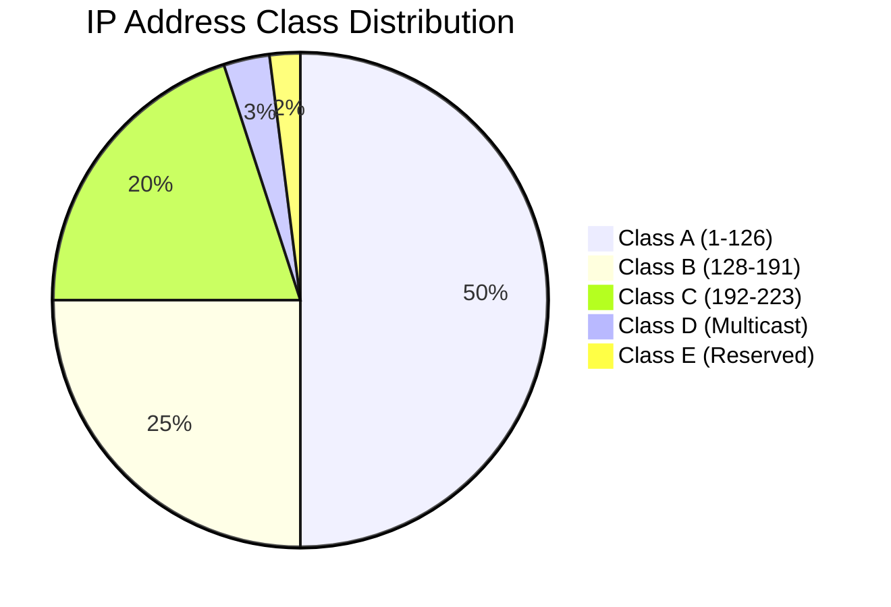

---

## 5. Subnetting Fundamentals

**Subnetting** is the practice of dividing a single large network into smaller, manageable sub-networks (subnets).

### The Subnet Mask

A subnet mask tells the computer which part of the IP address represents the **Network** and which part represents the **Host** (the specific device).

- In `255.255.255.0`, the first three octets are the network, and the last is for devices.

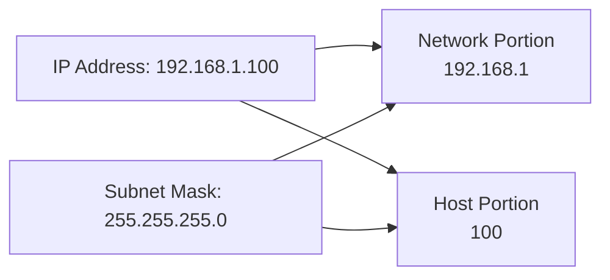

### Why Subnet?

1. **Security**: Keep different departments or guest Wi-Fi isolated
2. **Performance**: Reduces network "noise" (broadcast traffic)
3. **Organization**: Makes it easier to manage large numbers of devices

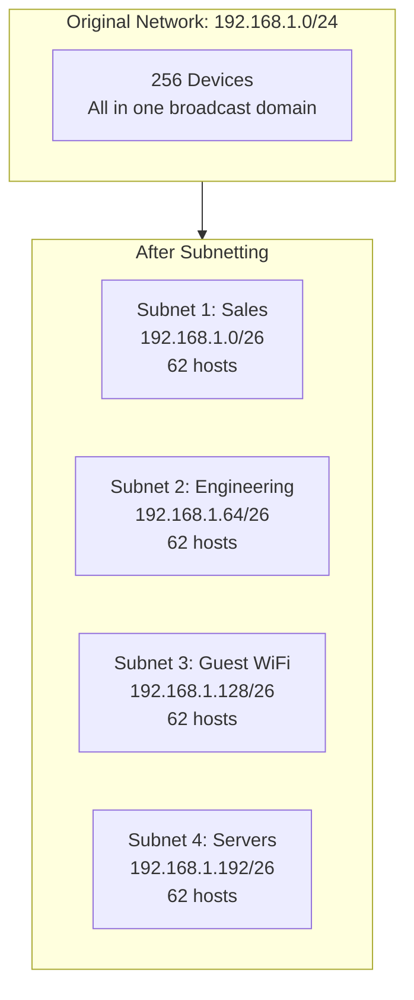

---

## 6. How to Subnet (The Calculation)

To subnet, we "borrow" bits from the Host portion of the IP address and give them to the Network portion.

### Steps to Subnet:

1. **Determine how many subnets you need**
2. **Use the formula** `2^n`, where `n` is the number of bits borrowed
   - If you borrow 2 bits, you get 2² = 4 subnets
3. **Calculate usable hosts**. Use the formula `2^h - 2`, where `h` is the remaining host bits
   - **Why -2?** One address is reserved for the Network ID and one for the Broadcast Address

### Example:

If you have a Class C network (`192.168.1.0`) and need 2 subnets:

- **Borrow 1 bit**: 2¹ = 2 subnets
- **Your new subnet mask becomes** `255.255.255.128`
- **Subnet 1**: `192.168.1.0` to `.127`
- **Subnet 2**: `192.168.1.128` to `.255`

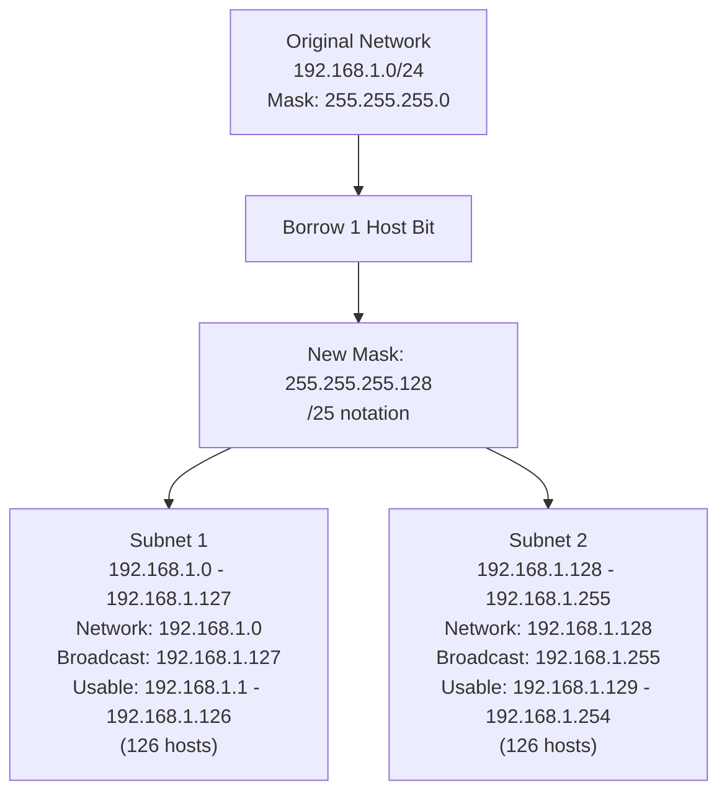

### Subnet Calculation Visualization

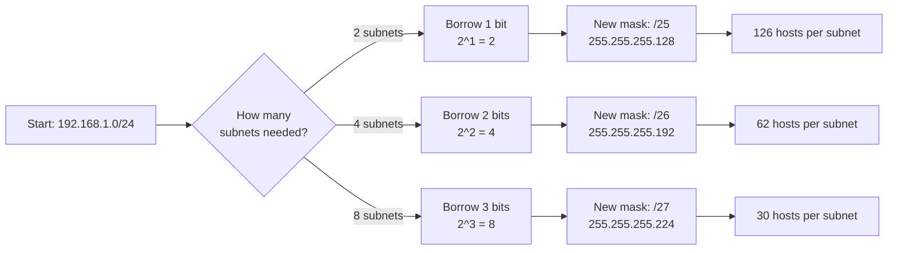

---

## 7. Practical Exercise for Students

### Task 1
Open your command prompt/terminal and type:
- **Windows**: `ipconfig`
- **Mac/Linux**: `ifconfig` or `ip addr`

Identify your local IP address.

### Task 2
Visit `whatsmyip.org` and compare that to your local IP.

**Question**: Are they the same or different? Why?

### Task 3
Calculate the number of hosts available if you use a subnet mask of `255.255.255.240`.

**Solution**:
- `255.255.255.240` = `/28` in CIDR notation
- This leaves 4 bits for hosts
- Formula: `2^4 - 2 = 16 - 2 = 14 usable hosts`

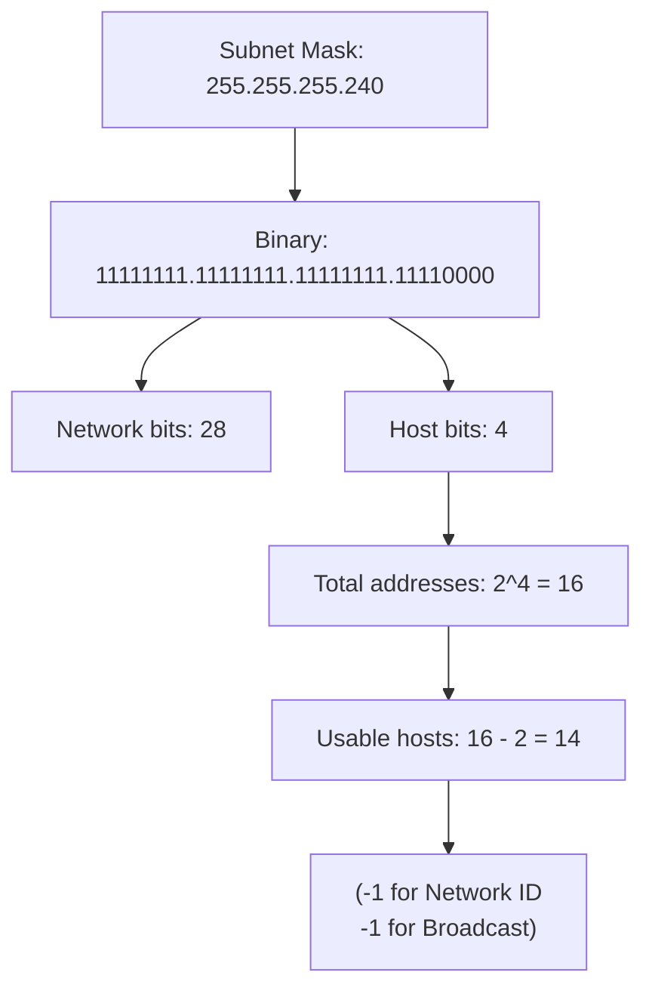

---

## Quick Reference Table

| CIDR | Subnet Mask | Available Hosts | Common Use |
|------|-------------|-----------------|------------|
| /24 | 255.255.255.0 | 254 | Standard home/small office |
| /25 | 255.255.255.128 | 126 | Divided small network |
| /26 | 255.255.255.192 | 62 | Department networks |
| /27 | 255.255.255.224 | 30 | Small teams |
| /28 | 255.255.255.240 | 14 | Very small groups |
| /29 | 255.255.255.248 | 6 | Point-to-point links |
| /30 | 255.255.255.252 | 2 | Router-to-router connections |

---

## Summary

Understanding IP addressing and subnetting is fundamental to networking. Key takeaways:

- **IP addresses** uniquely identify devices on a network
- **Public IPs** are visible to the internet; **Private IPs** are for local networks
- **NAT** allows multiple devices to share one public IP
- **Subnetting** divides networks for better organization, security, and performance
- **Subnet masks** define the network and host portions of an IP address
- Practice calculations to master subnetting!

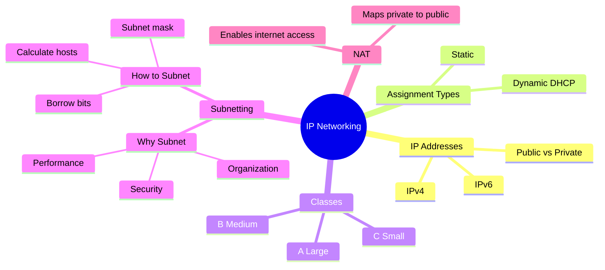