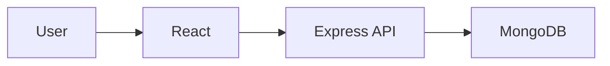
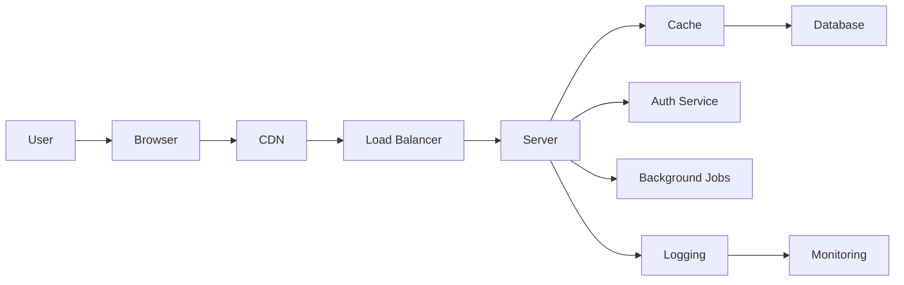
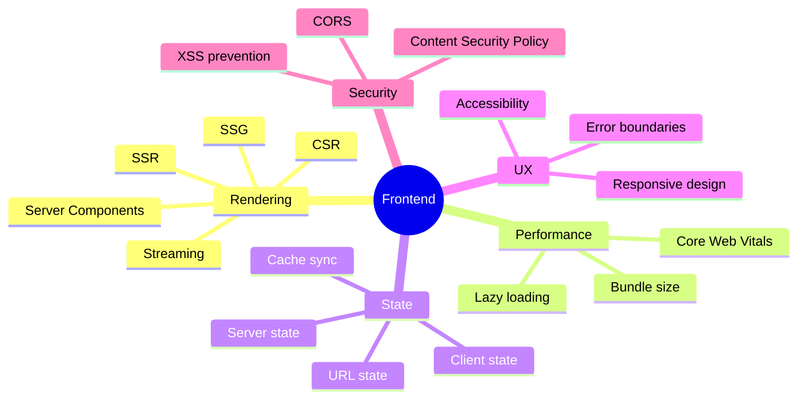
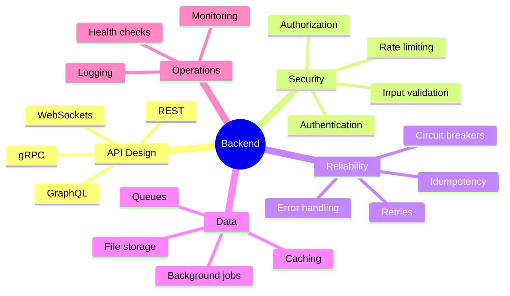
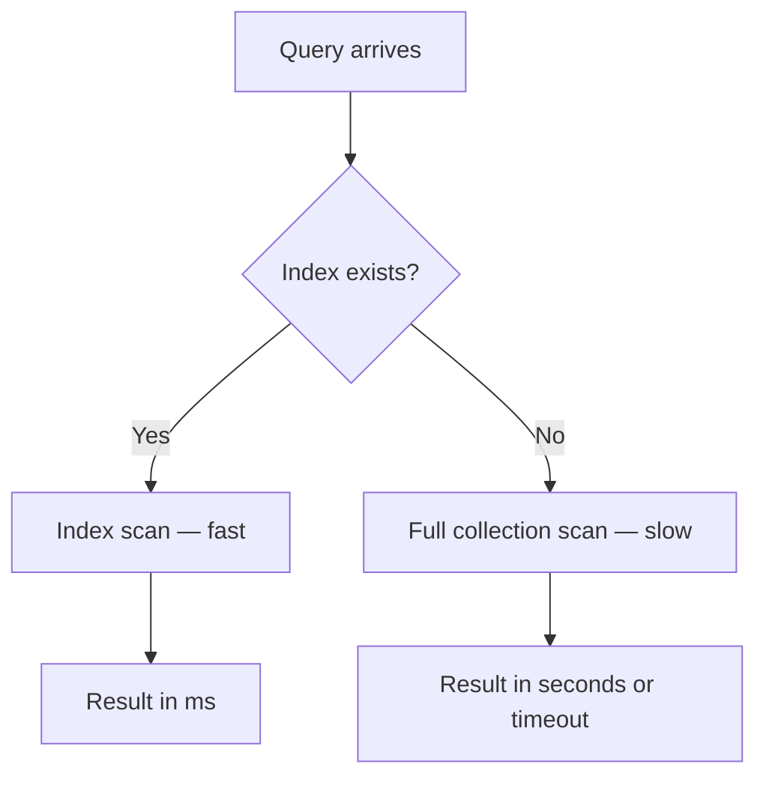
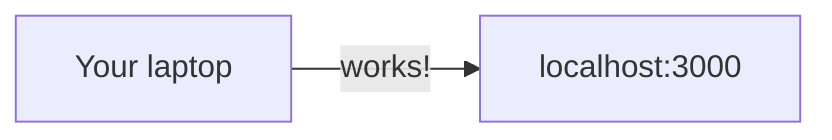
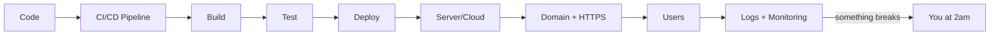
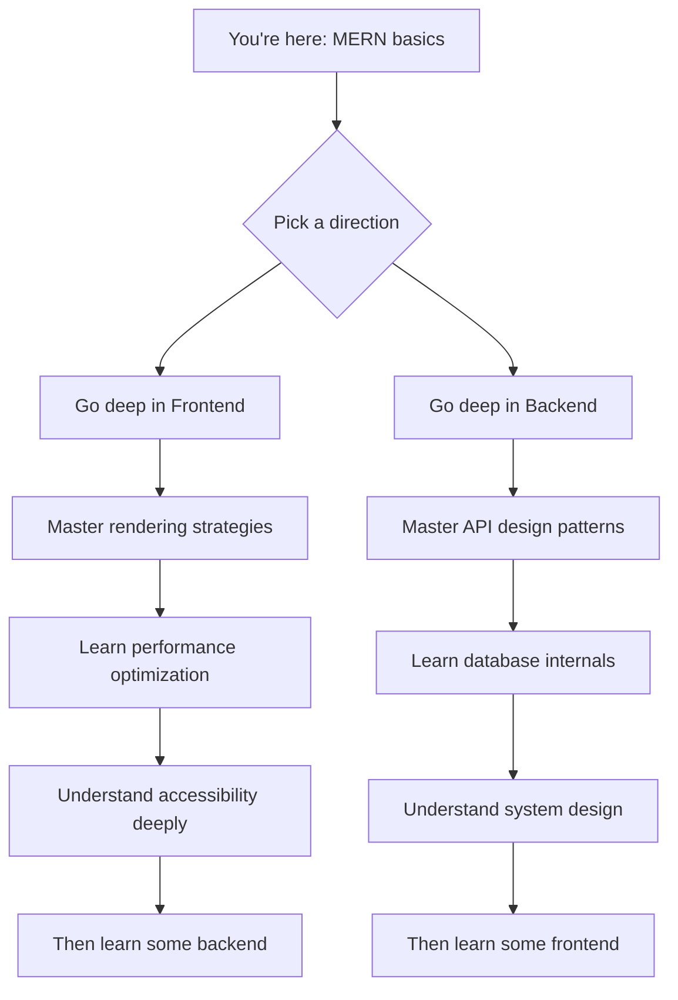
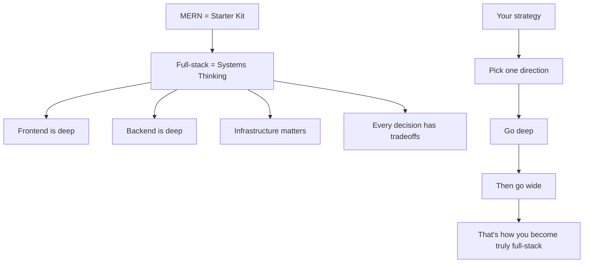

# Beyond MERN: What Full-Stack _Actually_ Means

---

## You finished a MERN course... now what?

> "I know MongoDB, Express, React, and Node. Am I full-stack now?"

Let's find out.

---

## Quick questions

- Your app is slow in production. Where do you look first?
- Login works locally but fails when deployed. Why?
- Your database has 1 million users now. What breaks?
- A hacker sends 10,000 requests per second. What happens?

If you're unsure about most of these — that's okay. That's why we're here.

---

## What MERN actually gives you

```
React     →  A UI library
Express   →  A backend framework
MongoDB   →  A NoSQL database
Node.js   →  A JavaScript runtime
```

This is a **starter kit**. It lets you build a working app.

But a working app is not a production system.

---

## The iceberg

**Above the water:** your React UI, your Express routes, your MongoDB queries.

**Below the water:** networking, security, caching, deployment, monitoring, scalability, databases at depth, performance, cost...

MERN is the tip. The rest of this session is the water.

---

## What actually happens when a user visits your app?

You type a URL. Simple, right?


DNS lookup, TCP handshake, TLS negotiation, HTTP request, server processing, database query, response, rendering...

> MERN doesn't teach you any of this. But full-stack engineers understand it.

---

## The beginner's mental model



Simple. Clean. **Incomplete.**

---

## The real picture



Every box is a layer. Every layer has tradeoffs. Every tradeoff requires understanding.

**This** is what full-stack means.

---

## Let's zoom into each layer

We won't go deep — just enough to show you how much there is to learn.

---

## Frontend is NOT just components

What beginners think frontend is:

- Write JSX
- Use `useState`
- Call an API with `fetch`

What frontend actually includes in 2026:



> Frontend alone is deep enough for an entire career.

---

## How your page gets rendered — it's not always the same


**CSR:** Browser downloads JS → JS builds the page. Fast navigation, bad SEO.


**SSR:** Server builds HTML → sends ready page. Good SEO, more server cost.

Each strategy has tradeoffs. Choosing the right one is an engineering decision.

---

## Backend is NOT just routes

What beginners think backend is:

```js
app.get("/users", (req, res) => {
  // get users from DB
});
```

What backend actually includes:



> Backend alone is deep enough for an entire career.

---

## Databases: way beyond CRUD

What beginners know:

```js
db.collection("users").find({}); // Read
db.collection("users").insertOne(); // Create
db.collection("users").updateOne(); // Update
db.collection("users").deleteOne(); // Delete
```

What you'll eventually need to understand:



And that's just **indexing**. There's also:

- Transactions and isolation levels
- Data modeling for read vs write patterns
- Replication and consistency models
- Connection pooling and query optimization

---

## The deployment gap

It works on your machine. Great.



Now deploy it:



Environment variables, secrets, Docker, CI/CD, SSL certificates, domain config, logging, crash recovery...

> If your app crashes in production and you can't read the logs — you're not operating full-stack yet.

---

## Every decision has a cost

This is the real skill. Not knowing tools — knowing **tradeoffs**.

| Decision      | You gain                       | You pay                            |
| ------------- | ------------------------------ | ---------------------------------- |
| SSR           | Better SEO, faster first paint | More server compute cost           |
| Redis cache   | Faster reads                   | Cache invalidation complexity      |
| Serverless    | Zero ops management            | Cold start latency                 |
| Microservices | Team independence              | Network complexity                 |
| MongoDB       | Schema flexibility             | Harder joins, eventual consistency |

> Full-stack thinking = understanding that **every improvement has a cost somewhere else.**

---

## So... should you learn everything?

**No.**

This is where most beginners go wrong. They try to learn frontend AND backend AND DevOps AND databases AND everything at once.

The result? Surface-level knowledge everywhere. Deep understanding nowhere.

---

## Be T-shaped, not flat


**Specialist:** deep in one thing, blind to everything else.
**Generalist:** knows a little about everything, expert in nothing.
**T-shaped:** deep in one area + broad awareness of the rest.

> This is the goal. Go deep first, then go wide.

---

## Pick your depth



Don't switch too early. **Depth creates understanding. Breadth without depth creates confusion.**

---

## Frontend depth path

If you choose frontend, here's what going deep looks like:

1. **Understand the browser** — DOM, CCSOM, event loop, rendering pipeline
2. **Master one framework** — really master it, not just use it
3. **Learn rendering strategies** — CSR, SSR, SSG, RSC and when to use each
4. **Performance** — bundle analysis, lazy loading, Core Web Vitals
5. **Accessibility** — ARIA, keyboard nav, screen readers
6. **State management** — beyond `useState`, think data flow architecture

Then, with that depth, backend concepts will click faster.

---

## Backend depth path

If you choose backend, here's what going deep looks like:

1. **Understand HTTP deeply** — methods, headers, status codes, caching headers
2. **Learn API design** — REST principles, versioning, error handling patterns
3. **Master your database** — indexing, query optimization, data modeling
4. **Security** — authentication flows, authorization patterns, OWASP top 10
5. **Reliability** — error handling, retries, idempotency, circuit breakers
6. **System design basics** — caching, queues, load balancing

Then, with that depth, frontend will feel like a natural extension.

---

## The roadmap is HUGE

Take a look at the full roadmaps for frontend and backend:

- **Frontend roadmap:** [roadmap.sh/frontend](https://roadmap.sh/frontend)
- **Backend roadmap:** [roadmap.sh/backend](https://roadmap.sh/backend)

Scroll through them. Feel the scale. That's not to scare you — it's to show you that **this is a long journey, and that's normal.**

Nobody learns all of this in 6 months.

---

## The mental model shift

Stop asking:

> "What stack should I learn?"

Start asking:

- How does this request travel from user to server and back?
- Where could this be slow?
- What happens if this fails?
- What's cached and what's fresh?
- What costs money here?

That shift — from **"what tools do I use"** to **"how does this system work"** — is what separates a stack user from a systems thinker.

---

## Recap



---

## Final words

> MERN is not the destination. It's the introduction.

You are not behind.
You are at the beginning of something much deeper.

**Go deep. Stay curious. Build things that break — and learn why they broke.**

---

_Want to explore more? Check out:_

- [roadmap.sh](https://roadmap.sh) — _Visual developer roadmaps_
- [web.dev](https://web.dev) — _Google's web development guide_
- [ByteByteGo](https://bytebytego.com) — _System design visuals_
